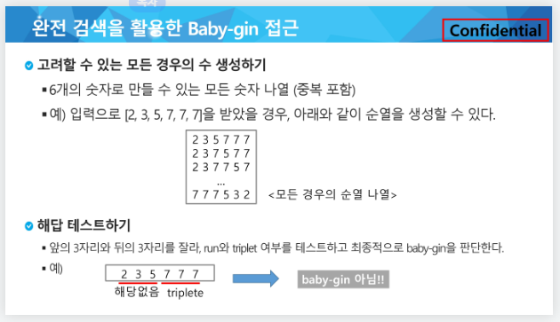

# algorithm_list

- 알고리즘
  
  - 문제를 해결하기 위한 절차나 방법
  
  - 주로 컴퓨터 용어, 컴퓨터가 어떤 일을 수행하기 위한 단계적 방법
  
  - 의사코드 / 순서도 2가지로 나뉜다.

- 좋은 알고리즘이란?
  
  - 정확성 : 얼마나 정확하게 동작하는가
  
  - 작업량 : 얼마나 적은 연산으로 원하는 결과를 얻어내는가
    
    - 알고리즘의 작업량을 표현할 때 시간복잡도로 표현한다.
    
    - 빅-오(O) 표기법
      
      - 시간 복잡도 함수 중에서 가장 큰 영향력을 주는 n에 대한 항만을 표시
  
  - 메모리 사용량 : 얼마나 적은 메모리를 사용하는가
  
  - 단순성 : 얼마나 단순한가
  
  - 최적성 : 더 이상 개선할 여지없이 최적화 되어 있는가
  
  - 

- 배열
  
  - 일정한 자료형의 변수들을 하나의 이름으로 열겨하여 사용하는 자료구조
  
  - 메모리에 같은 이름으로 저장해둔것을 배열이라 한다.
  
  - 배열을 사용하면 하나의 선언을 통해서 둘 이상의 변수를 선언할 수 있다.
  
  - 단순히 다수의 변수 선언을 의미하는게 아니라 다수의 변수로 하기 힘든 작업을 배열을 이용하여 쉽게 할 수 있다.

- 버블 정렬
  
  - 인접한 두 개의 원소를 비교하며 자리를 계속 교환하는 방식
  
  - 첫 번째 원소부터 인접한 원소끼리 계속 자리를 교환하며 맨 마지막자리까지 이동
  
  - 인접한 원소 2개씩 비교하니 반복문 2번써야함
  
  - 2번쓸동안 반복문에 들어갈 반복문의 길이를 잘 재야함

- 카운팅 정렬
  
  - 항목들의 순서를 결정하기 위해 집합에 각 항목이 몇 개씩 있는지 세는 작업을 하여, 선형 시간에 정렬하는 효율적인 알고리즘
  
  - 제한사항
    
    - 정수나 정수로 표현할 수 있는 자료에 대해서만 적용 가능
    
    - 카운트들을 하기 이한 충분한 공간을 할당하려면 집합 내의 가장 큰 정수를 알아야 한다.
  
  - 배열내에 같은 값이 있을때 배열의 순서가 바뀌지 않고 정렬되는걸 안정정렬 이라하는데 카운팅 정렬을 써서 안정정렬을 해줄수 있다.
  
  - ` data = 0,4,1,3,1,2,4,1`
  
  - `counts = ,1,3,4,6,7`
  
  - `temp = data의 길이만큼 배열 생성`
  
  - 이 값을 원본 data의 값을 손상하지 않고 안정정렬 하기 위해 data배열의 뒤에값 부터 읽어 와서 temp 배열에 정렬을 하는데 temp에 값을 채워넣기 위해 counts의 값을 읽어와야 함
  
  - counts는 temp의 index에 해당하고 data는 counts의 index에 해당함 이 값들을 안정정렬 할때 temp에 들어가는 값은 data의 값들이 counts 값을 index로 받아와서 temp배열에 정렬함

- 선택 정렬

- 완전검색
  
  - 모든 경우의 수를 나열해보고 확인하는 기법
  
  - 수행속도는 느리지만 해답은 잘 찾아냄
  
  - baby_gin game
  
  - 연속하는 숫자 3개 또는 같은숫자 3개로만 이루어진 6장의 카드가 있다면 baby-gin 이라함
  
  - 

- 그리디
  
  - 최적해를 구하는 데 사용되는 근시안적인 방법
  
  - 여러 경우 중 하나를 결정해야 할 때마다 그 순간에 최적이라 생각되는 것을 선택해 나가는 방식으로 최종적인 해답에 도달
  
  - 각 시점마다는 최선의 선택인데 그것이 최종적으로 최적이라는 보장은 없다
  
  - 일반적으로 머릿속에 떠오르는 생각을 검증 없이 바로 구현하면 greedy 접근이 된다.
    
    1. 해 선택 : 현재 상태에서 부분 문제의 최적 해를 구한다
    
    2. 실행 가능성 검사 : 새로운 부분해 집합이 실행 가능한지를 확인한다.
    
    3. 해 검사 : 새로운 부분해 집합이 문제의 해가 되는지를 화인한다.

