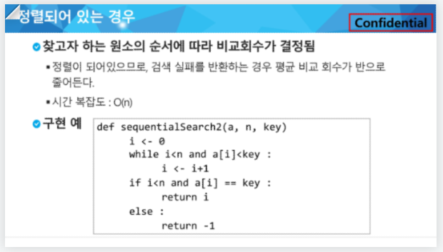
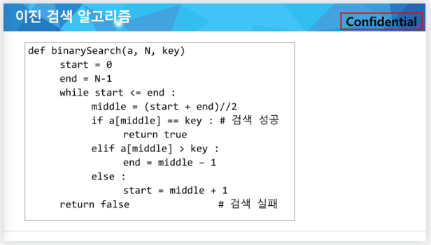
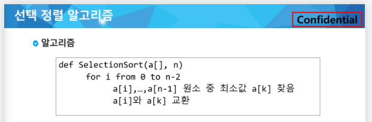
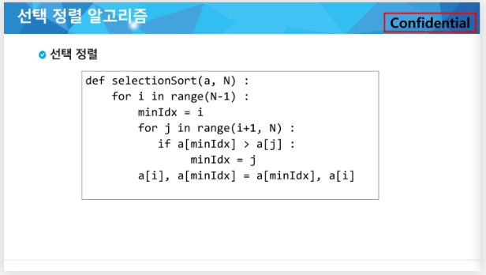

algorithm part 03

- ## 검색
  
  - ## 목적하는 탐색키를 가진 항목을 찾는 작업
    
    - 탐색키 : 자료를 구별하여 인식할 수 있는 키
  
  - 순차검색
  
  - 이진검색
  
  - 해쉬

## 순차검색

- 일렬로 되어 있는 자료를 순서대로 검색하는 방법
  
  - 유튜브 재생바 생각하면 될듯

- 가장 간단하고 직관적인 검색 방법

- 배열이나 연결 리스트 등 순차구조로 구현된 자료구조에서 원하는 항목을 찾을 때 유용함
  
  - ### 검색과정
    
    - 첫 번째 원소부터 순서대로 검색 대상과 키 값이 같은 원소가 있는지 비교하며 찾는다
    
    - 키 값이 동일한 원소를 찾으면 그 원소의 인덱스를 반환
    
    - 검색대상을 못찾으면 검색 실패

2가지 경우가 있는데

정렬되어 있지 않은 경우

정렬되어 있는 경우

찾는값보다 큰값이 튀어나온다면 더이상 반복문을 실행하지 않고 종료

### 

## 이진 검색(자료가 정렬되어 있어야 한다.)

- 자료의 가운데에 있는 항목의 키 값과 비교하여 다음 검색의 위치를 결정하고 검색을 계속 진행하는 방법
  
  - 목적 키를 찾을 때까지 이진 검색을 순환적으로 반복 수행함으로써 검색 범위를 반으로 줄여가며 보다 빠르게 검색을 수행함

- 자료의 삽입이나 삭제가 발생하였을때 배열의 상태를 항상 정렬 상태로 유지하는 추가 작업이 필요함

재귀 함수를 이용하여 구현할 수 도있는데 재귀함수의 연습을 위해서는 해볼만 한데 실제 이진 검색을 하려고 할때는 반복문 쓰는게 더 빠르다

- ### 검색과정
  
  - 자료의 중앙에 있는 원소를 고른다.
  
  - 중앙 원소의 값과 찾고자 하는 목표 값을 비교한다.
  
  - 목표값이 중앙값보다 작으면 왼쪽에서/ 크다면 오른쪽에서 검색 수행
  
  - 찾을때까지 위의 과정을 반복

## 선택 정렬

- 주어진 자료들 중 가장 작은 값의 원소부터 차례대로 선택하여 위치를 교환하는 방식

정렬 과정

- 주어진 리스트 중에서 최솟값 찾기

- 그 값을 리스트의 맨 앞에 위치한 값과 교환

- 맨 처음 위치를 제외한 나머지 리스트를 대상으로 위 과정 반복
