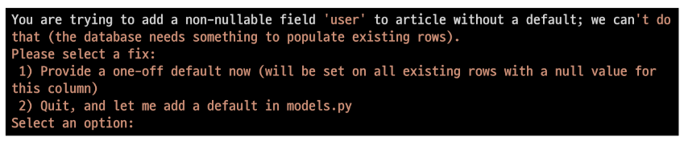
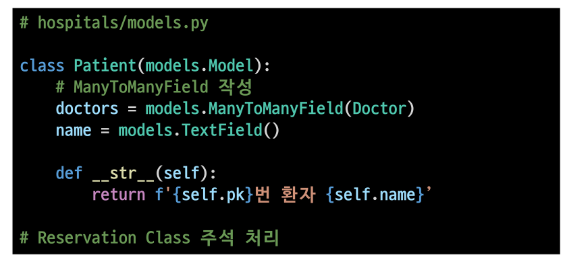

# 데이터베이스 관계(M:N)

데이터 모델링

- 주어진 개념으로부터 논리적인 데이터 모델을 구성하는 작업

모델 관계 설정

## 댓글 작성자 보이게 하기

- ### comment models 에서 user 가 보여야 하는거

> user를 외래키로 참조받아서 N:M 관계를 먼저 구현해 줄거

- 테이블을 수정한 거니까 makemigrations 다시 해줘야 함
  
  - `python manage.py makemigrations`

- 이때 NULL 값이 들어가서 오류가 발생하는데 이를 해결하기 위해 기본값을 설정해 줘야 함
  
  - user_id 값이 없다는 소리 이므로 1번을 선택해 자동으로 NULL 값을 채워주게 선택

- 이러면 자동으로 채워줄 값을 선택하라는 메시지를 출력하는데 user_id 값 이므로 1을 입력 후 enter

- `python manage.py migrate` 이후 다시 migrate 진행 해주면 됨

model값 추가 해주었는데 불필요한 화면이 출력되므로 forms.py 수정해줘야 함

exclude값에 user 추가후 저장 및 실행

- ### 수정 후 댓글 작성하기

이 때 user_id 값이 선택 없이 작성되어 에러발생

> 에러화면
> 
> 

NOT NULL 제약조건이 실패했다 > articles_comment 테이블의 user_id 값이 없어서

- ### views.py 수정하기

form.save 할때 user값이 안넘어 간거라 comment.user의 유저 정보를 넘겨주면 된다.

- ### 작성자 보이게 하기

detail 페이지 수정 해주기

user의 아이디를 보여주는 거니 detail 페이지 수정해 줘야함

contetnt로 댓글 가져오니 그 앞에 user로 user 정보를 가져오면 됨

> #### 출력화면
> 
> 

## 댓글 삭제

> - 현재는 로그아웃 후에 삭제를 눌러도 삭제가 발생함
> 
> - 지금의 comment에는 댓글 작성자의 정보가 저장되기 때문에 user의 정보가 일치할 경우 삭제버튼을 표시하게 끔 만들어 주기

- ### views.py 수정하기

댓글 삭제할때 삭제에 조건을 넣어주기

현재 유저의 정보가 입력되어 있는 유저 정보와 일치할 경우 삭제 가능하게 해줌

- ### 버튼의 표시 여부 구현

detail 페이지 수정해 주기

if 조건문을 이용하여 버튼의 표시여부를 구분해 줄 수 있음

입력받은 유저 정보가 일치할 경우 버튼 표시 여부 구분해 주는거

## 인증된 사용자에게만 보여주게하기

> - 로그아웃 상태로 댓글을 작성하려 하면 페이지 터짐
> 
> - 로그아웃인 경우 로그인 페이지로 넘기고 로그인인 경우 댓글 작성 가능하게 하기

- ## views.py 수정해주기

- ### 댓글 작성

is_authenticated 이용해서 로그인 여부 판별해 줄거

로그인 되지 않은 경우 로그인 페이지를 보여주게 accounts:login으로 redirect 시켜주는거

- ### 댓글 삭제

마찬가지로 댓글 삭제 역시 로그인 된 경우에만 보여주게 하기

- ### 댓글 작성 창 보여주기

- ### detail의 html 수정해주기

전체 댓글창 자체를 인증된 경우(로그인) 만 보여줄 거기 때문에 if 조건문을 전체에 걸어줌

로그인이 안된경우 else 문으로 로그인 창으로 가는 페이지 링크 달아주기

# N : M 연습해보기

## <명세서>

- 병원의 의사와 환자의 데이터 N : M 으로 연결하기

### 생각할것

- 한 명의 의사에게 여러 환자가 예약 가능

- 한 명의 환자를 여러 의사가 접근가능

## 모델관계 설정하기

> 

- 이렇게 작성하면 Patient 테이블에서 의사에게 예약할 때 환자가 의사를 직접 지정해서 작성해야 함

이렇게 되면 제 1 정규형인 데이터의 참조 무결성 조건을 지키기 어려움

의사가 바뀌게 되면 의사를 지정하여 저장한 환자 테이블을 일일이 전부 다 수정해 줘야 하기 때문임

## 중개 모델 설정하여 예약받기

> - 환자 모들의 외래 키를 삭제하고 별도의 예약 모델을 새로 작성
> 
> - 의사와 환자에 각각 N:1관계를 가지게 설정

생성 후 예약 만들기

의사와 환자가 각각 예약 정보를 찾기위해 Reservation에 접근하는 것은 역참조에 해당하므로 reversation_set 으로 접근하여야 함

## Django의 내장함수 이용하기

> - 환자 모델에 ManyToManyField 설정해주기

의사와 환자 생성 방법은 위와 동일

### 예약 추가하기

- 예약 추가는 doctors로 저장된 필드 이름을 가져와 add를 이용하여 추가

### 예약 목록 확인하기

- 환자테이블에서 예약 목록을 확인 하기 위해 접근할 때 doctors 로 접근

- 의사테이블에서 예약 목록을 확인 하귀 위해 접근할 때는 테이블_set 으로 접근

둘다 역참조라 테이블명_set 으로 접근해야 하는데 환자테이블에 작성한 doctors는 related_name이 적용된 거라 보면된다 그래서 doctors로 저장한 변수명으로 접근이 가능

### 예약 취소 하기

환자 테이블에서 의사 테이블 접근 해서 정보 가져올 때 _set으로 접근하기 불편하니 related_name='' 으로 접근이름 변경하여 접근 가능함

## 내장 함수와 중개 테이블 모두 이용하기

- `through='중개테이블명'` 으로 접근 가능

- 중개 테이블 똑같이 작성

## ManyToManyField 의 속성

1. related_name
   
   - 역참조 할때 사용되는 매니저의 이름을 바꿔주는 것
   
   - Foreignkey의 related_name과 동일하다

2. through
   
   - 중개 테이블을 직접 작성할 때 through 옵션을 이용하여 중개 테이블을 나타내는 Django 모델을 지정가능하다.

3. symmetrical
   
   - 대칭이란 뜻으로
   
   - A가 B를 추가하거나 팔로우 하는 순간 B도 자동으로 A를 추가하거나 팔로우 하게 만듬
   
   - 기본적으로 True 값을 가지고 있음
   
   - 동일한 모델을 카리키는 경우 사용

# 실습

Article의 Like 기능 구현하기

## model 작성하기

1. ManyToManyField 작성하기
   
   
   
   - 이 후 migrations 하면 오류남
   
   - 오류가 이전에 사용된 manager 이름이 겹쳐 user가 작성한 글과 user가 좋아요 누른 글을 구분할 수 없어서 오류가 남
   
   - 오류 해결을 위해 related_name 작성해줘야 함

2. related_name 작성하기
   
   

## url 및 view 함수 작성

1. url 작성
   
   - likes 로 입력 받을때 해당 게시글에 대한 정보가 있어야 하므로 article의 pk값을 받아서 likes로 넘겨주는거
   
   

2. view 작성
   
   - url 을 likes로 입력받기 때문에 view도 likes로 입력
   
   - article 입력받고, 조건에 따라 좋아요를 보이게 / 안보이게 구분
   
   

## html 구현

1. 조건에 따라 좋아요 버튼을 다르게 표시하기

## 좋아요 갯수 세기

- html에 조건을 이용하여 갯수 표현하기

