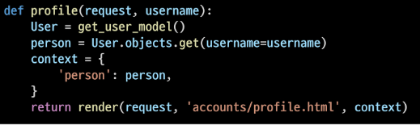
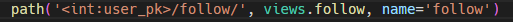
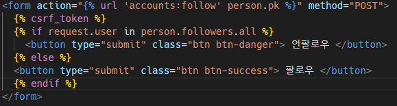

# 05 N : M (user <-> user)

## 개인 Profile 페이지 구현하기

> - 새로운 url 및 views 작성 해주기
> 
> - html 작성

### url 작성

프로필은 새로운 url로 입력 받으니 새로 path 작성해 줘야함

- url 입력시 user.pk 로 입력 받아도 되는데 str 에 해당하는 username 으로 입력 받아도 된다.

### views 작성

url에서 username을 입력 받았으니 view에서 username 을 이용해서 html 조작해줌

username 을 이용해 html을 조작하기 위해 Django 의 내장함수 중 get_user_model 이용해줌

### html 작성

context에 person으로 담아서 넘겼으니 html에서 유저 정보를 불러오려면 `person.` 으로 작성

- 상단에 프로필의 이름띄우기 / 작성한 게시글 보이기

<mark>부트스트랩 적용하기</mark>

- 클래스로 묶어서 클래스 이름에 부트스트랩 작성해주기

- 좋아요를 누른 게시글과 목록으로 돌아가는 태그

- index 페이지의 상단 user.name 을 누르면 user.profile 로 넘어가기

- 메인페이지인 index 에서 글 작성자를 누르면 해당 글 작성자의 프로필로 들어가는 링크 만들기

index.html 의 작성자 띄워주는 부분에 a 태그로 링크 걸어주기

## 프로필에 following 과 followers 구현하기

### 1. ManyToManyFeild 작성

accounts의 models 에 테이블 수정해줄거

최초 pass 로 작성하며 작성 가능한 최초의 상태 만들어 둠

거기에 MTM 필드 걸어줄거

필드에 self로 걸었으니 자기 자신을 눌렀을때는 아무일도 일어나면 안되니 symmetrical은 False 값 주기

### 2. url 및 view 함수 구현

- 팔로우 기능은 유저가 로그인 된 상태에서 모든 작업이 이루어짐

- url 과 views 작업은 accounts 앱에서 이루어짐

- url 입력은 follow로 입력 받을때

- views 는 follow로 요청이 들어오니 views도 follow 로 처리

1. 모든 요청은 POST로 이루어 지기 때문에 POST를 데코레이션 걸어줌

2. 팔로우 요청과 취소는 로그인이 이루어진 상태에서 이루어 져야 하기에 is_authenticated 걸어줌

3. 유저의 정보는 get_user_model을 이용해서 들고오는데 뒤에 .objects를 이용하여 바로 해당 유저의 정보를 들고옴

4. 이후 if 조건문을 이용하여 follow 와 unfollow 구분해줌

5. 로그인 if 조건문을 타지 못할때 반환해줄 return 작성

### 3. html 수정

- 보통의 follow 버튼과 unfollow 버튼은 누르면 unfollow 가 보이고 안누르면 follow 가 보여짐

1. MTM 필드를 장고의 내장함수를 이용하여 작성하였기에 접근하는 변수명을 따로 정의 해 뒀음
   
   - 여기서 followings 로 정의함 
   
   - 마찬가지로 related_name 을 이용하여 반대의 접근도 followers로 정의해 둠

2. 테이블.매니저이름.실행할 함수 순으로 작성되는데 접근 테이블의 이름은 person 임 views 에서 context에 person으로 담아서 넘겨 주었기 때문임

3. 매니저 이름은 내장함수와 related_name으로 바꿔 주었기에 바꾼 이름을 이용해 작성

4. 실행할 함수는 count 이므로 count 작성

1. 팔로우 언팔로우는 pk 정보를 받아서 작업이 이루어지니 form 형태로 이루어짐

2. form 형태에 POST 형식으로 요청이 들어오므로 csrf_token 작성해줌

3. if 조건문을 이용하여 팔로우 상태를 분기해줌

4. 분기 할때 부트스트랩을 적용하여 분기해줌

# Fixtures

- 홈페이지 제공시 기본 제공 데이터 혹은 다른 사람들에 대한 데이터 정보를 같이 넘겨 줘야 할때 Fixtures를 이용

- 협업시 db를 같이 넘겨줄때 많이 사용된다.

- 데이터베이스를 미리 채우는 것이 필요할 때 초기 데이터를 Fixtures를 이용하여 제공

### 생성 및 로드

> 데이터 추출
> 
> - dumpdata
> 
> 데이터 입력
> 
> - loaddata

### 데이터 추출

- dumpdata

> 현재의 db 데이터를 json 파일로 만들어서 저장
> 
> `python manage.py dumpdata --indent 4 [app_name[.ModelName] [app_name[.ModelName] > {filename}.json`

[참고] N개의 모델 한번에 dump 하기

[참고] 모든 모델 한번에 dump 하기

저장된 데이터들은 프로젝트 최상단에 json 형태로 추출하였기에 json으로 저장됨

json 파일을 하나의 폴더 fixtures에 저장

Django는 설치된 모든 app의 디렉토리에서 fixtures 폴더 이후의 경로로 fixtures 파일을 찾는다.

### 데이터 입력

- loaddata

> fixtures의 내용을 검색하여 DB 로드하기
> 
> `pythno manage.py loaddata data.json`

[참고] N개의 데이터만 load 하기

[참고] 전체 데이터 load 하기

현재 db 파일을 삭제 후 다시 migrate 작업 진행

**loaddata를 한번에 실행하지 않고 하나씩 실행한다면 모델 관계에 따라 순서가 중요할 수 있음 테이블마다 필요한 키가 다르기 때문에 순서대로 넣어줘야 함 근데 이게 귀찮으면 한번에 N 개 로드하거나 전체 데이터 로드해주면 됨**

## <mark>오류날때</mark>

> 1. 보통 encoding code 오류가 나는데 한글을 못읽어서 나는 경우가 대부분일거임데이터를 저장할 때 -Xutf8 로 지정 후 manage.py 로 데이터 저장해주는거
> 
> 2. 이미 데이터를 저장했는데 받아올때 오류가 난 거면 메모장으로 다시 encoding 해서 저장해 줘도 된다.

# Improve Query

> Django ORM 특징
> 
> - 기본적으로 Lazy Loading 전략 사용

ORM을 작성하면 DB에 query를 날리는데 

쿼리 1번에 N건의 데이터를 가져오는데 관련 컬럼을 얻기 위해 쿼리를 N번 추가 수행 하면 N + 1 problem 문제가 발생한다.

이를 해결하기 위해 Lazy Loading 전략 사용함

- ORM 작성하면 db에 쿼리하는 하는게 아닌 미루다가 실제 데이터를 사용할 때 db에 쿼리를 날리는거

- 똑같은 데이터를 사용하면 캐싱을 내부적으로 해둠

## Lazy Loading(지연 로딩)

> 

- 이렇게 하는 이유?
  
  - 성능 개선을 위해서
  
  - 객체와 RDB를 연결하는 ORM 입장에서는, 객체 코드로 다루는 모든 경우에 호출을 하는것은 매우 비용이 많이 드는 작업이라 실제 해당 데이터가 필요한 시정에 db를 호출하는것

<mark>**예제**</mark>

> 

1. pet_qs 에서 선언만 하고 아직 쿼리를 날리지는 않음

2. 반복문 돌면서 모든 pet 데이터를 콜함

3. print 할때 pet의 name 데이터는 이미 가지고 있는데 pet 의 pet_sitter.first_name 은 없어서
   
   - 여기서 한번더 콜함
     
     - `>>> N + 1 problem 발생`

<mark>**해결법**</mark>

> - 처음 가져올때 pet_sitter.first_name을 가져오면 된다.
> 
> - `>>> Eager Loading`(즉시 로딩)
>   
>   - 지금 사용하지 않더라도 모든 데이터를 한번에 가져올 때 사용

## Eager Loading(즉시 로딩)

1. 시작시 모든 데이터 호출

2. print 찍을 때 모든 데이터가 있으므로 N + 1 problem 발생 안함

## Django ORM - Caching

- 특정 데이터를 불러온 후 재사용 할 경우 ORM은 저장해둔 캐싱을 사용함

- 불러온 데이터에 변화를 일으키는 쿼리가 아니라면 저장해둔 데이터 사용

1. users에 모든 데이터를 불러옴

2. first 유저로 첫번째 유저의 정보 불러옴

3. user_list로 다시 list의 모든 유저 불러옴

        `>> 두 번의 콜 발생`

콜 횟수를 줄이기 위해 유저의 정보 불러오는 방법을 바꿔줌

1. 최초 users에 모든 정보 1번 불러옴

2. user_list로 모든 정보를 리스트로 저장함 >>> 1번의 콜 발생

3. first 유저로 유저 정보 불러오는데 모든 유저 정보는 user_list에 담겨 있으므로 캐싱 사용

            `한 번의 콜 발생`
