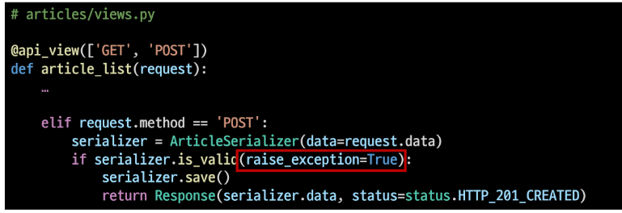
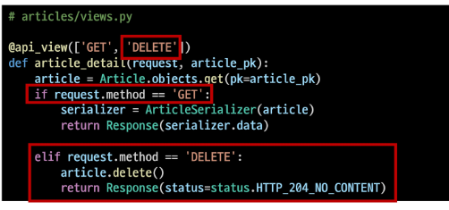
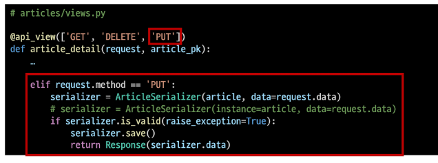
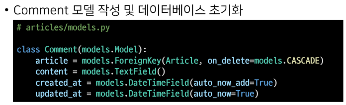
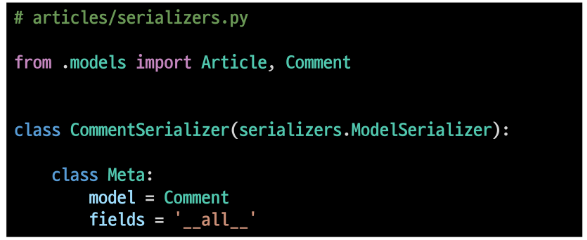
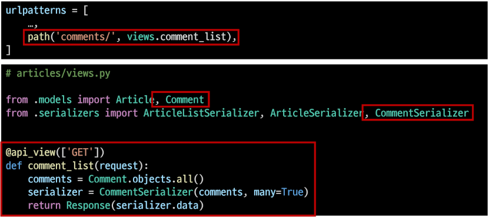
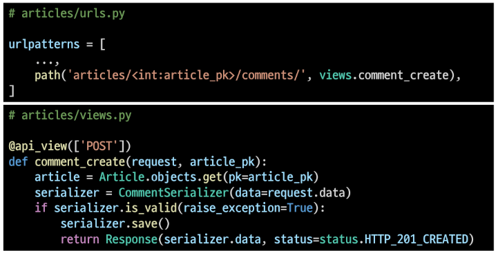
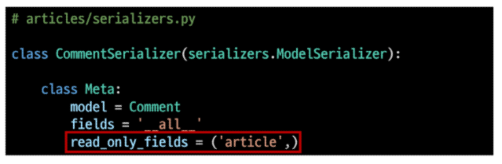
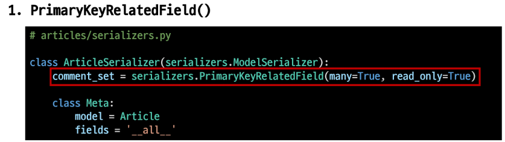
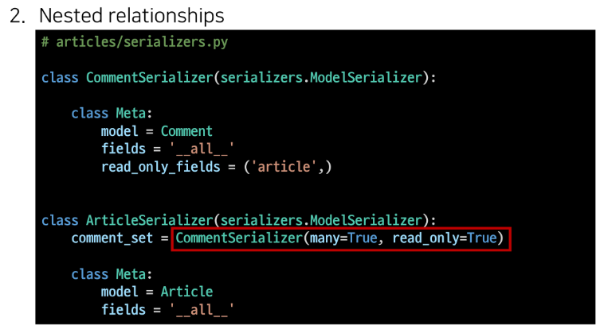

# Django REST framework

build RESTful API

생성에 대한 요청은 POST

`from rest_framework import status`

```python
def article_list(request):
    if request.method == 'GET':
        articles = Article.objects.all()
        serializer = ArticleListSerializer(article, many=True)
        return Response(serializer.data)

    elif request.method == 'POST':
        serializer = ArticleSerializer(data=request.data)        
        if serializer.is_valid():
            serializer.save()
            return Response(serializer.data, status=status.HTTP_201_CREATED)
        return Response(serializer.errors, status=status.HTTP_400_BAD_REQUEST)
```

- serializer 에 요청 데이터를 같이 넘겨서 보내줌

- 요청에 대한 데이터 생성이 성공했을 경우 201 CREATED 상태 코드를 반환하고

- 실패한 경우 400 BAD REQUEST를 응답한다.

- is_valid() 유효성 검사에 옵션 추가하기

조회에 대한 요청은 GET

### get_object_or_404

- 데이터를 찾을때 해당 데이터가 없다면 404 에러 코드를 리턴하는 에러코드

### get_list_or_404

- 데이터가 하나라도 없으면 404 반환
- `.all() 했을때 있다면 all과 같은 기능이고 없다면 404 반환`

raise_exception

- 오류가 있는 경우 ValidationError 예외를 발생시킨다.

- DRF에서 제공하는 기본 예외 처리기에 의해 자동으로 처리되며 기본적으로 HTTP 400 응답



- aritcle_detail 페이지를 반환하는 detail view에 접근하는 api를 다르게 하여 함수의 역할을 다르게 구성할 수 있다.
  
  - 데코레이터로 작성한 api_view 부분에 method 를 추가해주기
  
  - GET 요청과 DELETE 요청, PUT 요청에 따라 처리를 다르게 해주기
  
  - DELETE 요청에 따른 처리
  
  
  
  - 게시글 1개를 삭제하는 거니 게시글에 대한 pk 정보가 필요함
  
  - method 가 DELETE로 요청이 들어왔을때
    
    return시 status 앞에 딕셔너리 형태로 인자값 넘겨주는 방법도 있음
    
    `return Response({'pk' : article_pk}, status=status.HTTP_204_NO_CONTENT)`
  
  
  
  - PUT 요청에 따른 처리
  
  
  
  - 기존 정보를 넣고 데이터를 넣으므로 수정동작이 이루어짐
  
  - 수정에 대한 method 요청은 PUT으로 들어옴


# 1 : N 관계

- ForeignKey 는 N인 곳에 정의함

- 그래서 comment에 외래키 정의함



- READ



READ 요청은 GET 메소드로 접근함




- 단일 댓글 데이터 생성하기
  
  - 댓글 데이터를 생성하기 위해 게시글 정보가 있어야 하므로 article_pk 뒤에 comments를 넘겨받음
  
  - views 함수에도 넘겨받는 pk 값은 게시글의 pk 값을 넘겨받음
  
  - 게시글 정보를 불러온 후 serializer를 이용하여 commet 정보를 생성
  
  - 이후 serializer를 저장할 때 게시글 정보도 같이 저장해 줘야 함



- 근데 여기서 article필드의 pk 값 역시 사용자가 입력하는 것으로 설정되어 있어서 오류가 반환됨

- 이 때 article 필드를 읽기 전용필드로 설정해서 사용자의 입력없이 기존의 article 필드의 정보를 읽어와서 사용하게끔 작성



- 해당 필드는 읽기 전용이므로 유효성 검사에서 제외시키고 데이터 조회 시에는 출력하도록 해줌


역참조 데이터 조회

- 게시글 조회 시 해당 게시글의 댓글 목록까지 함께 출력하기




