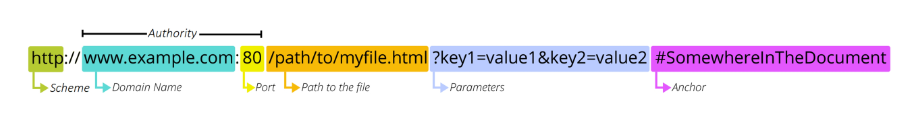

# 시험문제

코드베이스 시험

HTTP 는 연결을 유지하지 않고 돌려서 무상태

> ## HTTP 메서드

- GET

- POST

- PUT

- DELETE

각각이 하는일 기억하기

> ## HTTP response status codes

- 2학기때 주로 보게 되므로 알긴 해야함

- error 400 번대 ( 사용자가 잘못 )

- error 500 번대 ( 서버가 잘못 )

의미 검색할 때 MDN 403 치면 403이 무슨 뜻인지 구글에서 알려줌

> ## 리소스 식별 -> URI 로 식별한다

- URI - 통합 자원 식별자

- URL / URN

- URN 은 국제 표준 도서 번호에서 많이 사용

> ### URL의 형태

path 는 port 뒤에 위치

#### 파라미터는 `?`로 시작

- key 와 value 형태로 입력받고 

- & 기호로 구분된다.

- 파라미터는 GET 요청일 때만 값이 전달된다.

- POST 요청일 때는 전달되는 데이터가 숨어서 전달된다.

#### 앵커(신경 많이 안써도 된다.)

- id 로 어떤 값이 있을때 이 위치로 바로 이동가능하도록 링크를 만들어 주는거

> ## API

- 개발자가 복잡한 기능을 보다 쉽게 만들 수 있도록 프로그래밍 언어로 제공되는 구성

- API 응답 형태는 대표적으로 JSON

> ## REST(면접가면 가장 많이 물어보는것 중 하나)

- API 서버의 설계 방법론 중 하나

- 자원을 정의하고 자원의 주소를 지정하는 전반적인 방법을 서술

- 구조를 지키지 않는다고 오류가 나는건 아님 

- 하나의 설계 방법론중 하나일 뿐인데 많은 사람들이 사용하니 따르는게 좋다

#### 자원의 식별

- URI

#### 자원의 행위

- HTTP Method

#### 자원의 표현

- JSON

- 자원과 행위를 통해 궁극적으로 표현되는 (추상환된) 결과물

> #### [참고]
> 
> #### Restful?

- REST 원리를 따르는 시스템

식별자URI에 행위를 같이 쓰는것 ==> Restful 하지 않다고 한다.

- article/create

- article/update

- article/delete

> ## JSON

- JavaScript의 표기법을 따른 단순 문자열

- openAPI에서 가장많이 사용되는 응답형태

- Key - value 형태

- 처음부터 리스트안에 objects(딕셔너리) 구조로 된 경우도 있다.

> ## JsonResponse

장고에서 기본적으로 제공하는 JsonResponse를 사용

기본적으로 딕셔너리만 변환해 주므로 다른값을 넘겨주려면 safe=False 써줘야 함

> ## Serialization
> 
> - 직렬화 --> 변환
> 
> 나중에 다시 쉽게 사용할 수 있는 포맷(Json) 으로 변환하는 과정

장고의 Serialize를 쓰기보다는 DRF를 사용해 줄거

- DRF 는 설치해서 사용

- 설치해서 쓰니가 INSTALLED_APPS에 추가해 줘야함

- ModelForm과 비슷하게 쓰기때문에 serializers.py 파일을 만들어서 그안에 폼처럼 만들어서 써줌

- 폼 사용법과 동일한데 응답할때 form은 context에 파일을 넣어서 넘겨줬다면 serializers는 response 할때 serializer.data 로 넘겨주면 된다

#### 앞에 serializer은 변수명에 해당된다.

<mark>DRF에서 제공되는 기능으로 모델폼 보다 간단하게 사용가능함</mark>

DRF는 <mark>데코레이터가 필수적</mark>으로 사용되어야 한다.

사용은 @api_view 로 써주고

`@api_view(['GET'])` 이런식으로 들어오는 method 형식을 제한해 줘야한다.
