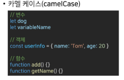
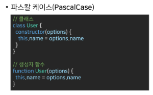
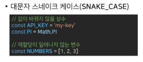
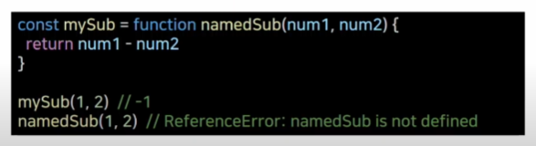
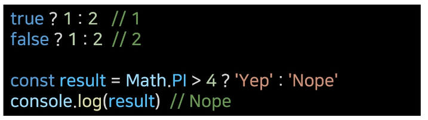

# JavaScript

> ## 웹 브라우저의 역할

- URL을 통해 웹을 탐색함

순수하게 JavaScript 문법들을 이용한 코딩을 바닐라 코딩이라 함

EcmaScript

- 표준화된 스크립트 프로그래밍 언어

- 자바스크립트를 표준화 하기위해 만들어짐

자바스크립트

- 세미콜론 써도 되고 안써도 되고

## 식별자

- 변수를 구분할 수 있는 변수명

- 식별자는 반드시 문자,달러,밑줄로 시작

- 대소문자 구분, 클래스명 이외에는 모두 소문자로 시작

- 예약어 사용 불가
  
  - 예약어 : for, if, function

- 카멜 케이스
  
  - 변수, 객체, 함수에 사용
  
  - 중간에 대문자 들어가는거 camelCase 이런식으로



- 파스칼 케이스
  
  - 클래스, 생성자에 사용
  
  - 첫문자부터 대문자 PascalCase 이런식



- 대문자 스네이크 케이스
  
  - 상수에 사용
  
  - 변경되지 않는 값 SNAKE_CASE



변수 선언 키워드

1. let
   
   - 블록 스코프 지역 변수를 선언 동시에 값을 초기화

2. const
   
   - 읽기 전용 상수를 선언 동시에 값을 초기화

3. var

> 함수(Function)

- 참조 타입 중 하나로써 function 타입에 속함

- JavaScript에서 함수를 정의하는 방법은 주로 2가지로 구분됨
  
  - 함수 선언식
  
  - 함수 표현식

> 함수 선언식

- 일반적인 프로그래밍 언어의 함수 정의 방식
  
  ```javascript
  function add(num1, num2){
      return num1 + num2
  }
  add(2, 7) // 9
  ```

> 함수 표현식

- 표현식 내에서 함수를 정의하는 방식

- 함수의 이름을 생략한 익명함수로 정의 가능

```javascript
const sub = function(num1, num2){
    return num1 - num2
}

sub(7, 2) // 5
```

- 표현식에서 함수 이름을 명시하는 것도 가능한데 호출에 사용되지 못하고 디버깅 용도로 사용됨



> 자동형변환

| 데이터타입     | false      | true         |
|:---------:|:----------:|:------------:|
| undifined | 항상 false   | X            |
| null      | 항상 false   | X            |
| Number    | 0, -0, NaN | 나머지는 전부 true |
| String    | 빈 문자열      | 나머지 모든 경우    |
| Object    | X          | 항상 true      |

> 할당 연산자

- 오른쪽에 있는 피연산자의 평가 결과를 왼쪽 피연산자에 할당하는 연산자

- 다앙한 연산에 대한 단축 연산자 지원

> 비교 연산자

- 피연산자들 을 비교하고 결과값을 boolean으로 반환

- 알파벳끼리 비교할 경우 알파벳 순서상 후순위가 더 크다
  
  - 소문자가 대문자보다 더 크다

> 동등연산자(==)

- 두 피연산자가 같은 값으로 평가되는지 비교 후 boolean 값을 반환

- 비교할 때 암묵적 타입 변환 통해 타입을 일치시킨 후 같은 값인지 비교(자동현변환 발생)

- 두 피연산작 모두 객체일 경우 같은 객체를 바라보는지 판별

- 예상치 못한 결과가 나올 수 있으니 특별한 경우를 제외하고는 사용 X

> 일치연산자(===)

- 두피연산자의 값과 타입이 모두 같은 경우 true 반환

- 암묵적 타입 변환 발생 X

- 엄격한 비교 > 두 비교 대상의 타입과 값 모두 같은 지 비교하는 방식

> 논리 연산자

- AND == &&

- OR == ||

- NOT = !

단축 평가 지원

- and -> 전부다 true ==> true

- or -> 1개라도 true면 true

- > ex false && true => false
  > 
  > ex true || false => true
  
  or => 둘중 하나라도 true 면 true 반환하니까 앞자리에 true가 오면 그냥 앞자리 바로 반환하고 끝내버림
  
  and => 둘다 true 여야 true 반환하니 둘다 비교해 보는데 뒤에거가 true 가 오면 뒤에거를 반환해줌

> 삼항연산자

- true ? 1 : 2 // 1

- fasle ? 1 : 2 // 2
  
  가장 앞의 조건식이 참이면 : 앞의 값이 반환되며, 반대의 경위 뒤의 값이 반환
  
  ? 부분은 조건식이 들어가는 부분
  
  

> 스프레드 연산자

- 배열이나 객체를 전개하여 각 요소를 개별적인 값으로 분리하는 연산자

- 얕은 복사를 위해서도 활용 가능

예를들어 리스트 안에 [3,4] 가 있고 이때 변수명이 const num 일 경우 표현식은

```javascript
const num = [3, 4]
// 여기서 other num 에 [1,2,5] 가 있는 경우 여기서 3 4 를 넣어서 1 2 3 4 5 를 만들려
const otherNum = [1,2, ...num, 5] // 이렇게 쓰면 됨
```

const copyNum = [...num] 하면 [3, 4] 보여줌

> 조건문

- if, else if, else
  
  - 조건은 소괄호
  
  - 실행 코드는 중괄호

```javascript
const name = 'manager'


if(name === 'admin') {
    console.log('관리자')
} else if(name === 'manager') {
    console.log('매니저')
}     
```


> 반복문

- for
  
  - 특정한 조건이 거짓으로 판별될 때 까지 반복
  
  - for ([초기문] [조건문] [증감문])
  
  - for (let i = 0; i < 6; i++)
    
    - i는 0부터 1씩 증가하느데 6이 되면 종료하는걸 이런식으로 표현함


- for in
  
  - 객체의 속성을 순회할 때 사용
  
  - 배열도 순회 가능하지만 인덱스 순으로 순회한다는 보장이 없으므로 권장X
