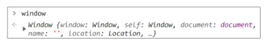
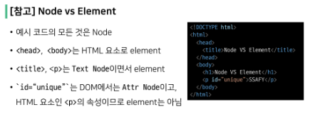
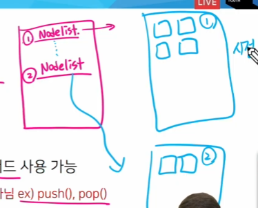
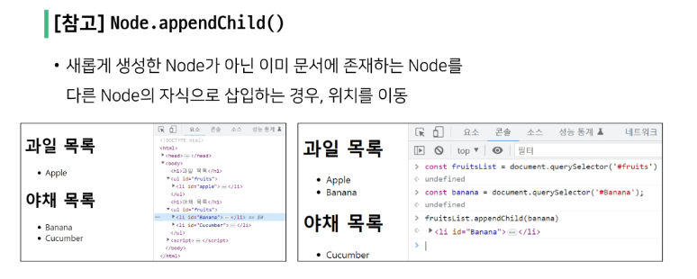

# 03_JavaScript_DOM

## DOM

- 브라우저에서의 JavaScript
  
  - 웹 페이지에서 다양한 기능을 구현하는 스크립트 언어

---

> 웹 페이지에서의 JavaScript

- Browser APIs

- Third party APIs
  
  - 브라우저에 탑재되지 않은 API
  
  - 웹에서 직접 코드와 정보를 찾아야 함
  
  - Google map api, kakao login api 등

---

> Browser APIs

- 웹 브라우저에 내장된 API

- 컴퓨터 환경에 관한 데이터를 제공하거나, 오디오를 재생하는등 여러가지 일을 수행 가능
  
  - DOM
  
  - Geolocation API
  
  - WebGl

---

> DOM

- 문서의 구조화된 표현을 제공

- DOM 구조에 접근할 수 있는 방법을 제공

- 문서구조, 스타일, 내용등을 쉽게 변경할 수 있게 도움
  
  - HTML / CSS를 조작할 수 있음
  
  - DOM API를 통해 HTML과 CSS를 동적으로 수정

- HTML 문서를 구조화 하여 각 요스를 객체로 취급

- 단순한 속성 접근, 메서드 활용, 프로그래밍 언어적 특성을 활용한 조작이 가능함

---

> DOM Tree

- 문서를 논리 트리로 표현

- DOM의 모든 것은 Node

---

> Node

- DOM의 구성 요소 중 하나

- HTML 문서의 모든 요소를 나타냄

---

> DOM의 주요 객체

- window
  
  - DOM을 표현하는 창
  
  - 가장 최상위 객체
  
  - 탭 기능이 있는 브라우저에서는 각각의 탭을 각각의 window 객체로 나타냄

- document
  
  - 브라우저가 불러온 웹 페이지
  
  - 페이지 컨텐츠의 진입점 역할을 하며 <body> 등과 같은 수만은 다른 요소들을 포함하고 있음

---

> [참고] Node vs Element

- Element는 태그

- 태그안에 text node가 있다

---

## DOM 조작

> 선택 관련 메서드

- document.querySelector(selector)
  
  - 제공한 선택자와 일치하는 element 한 개 선택
  
  - 제공한 CSS selector를 만족하는 첫 번째 element 객체를 반환(없다면 null 반환)

- document.querySelectorAll(selector)
  
  - 제공한 선택자와 일치하는 여러 element를 선택
  
  - 매칭 할 하나 이상의 셀렉터를 포함하는 유효한 CSS selector를 인자(문자열)로 받음
  
  - 제공한 CSS selector를 만족하는 NodeList를 반환

---

> [참고] NodeList

- DOM 메서드를 사용해 선택한 노드의 목록

- 배열과 유사한 구조

- Index로만 각 항목에 접근 가능

- 배열의 다양한 메서드 및 forEach 등 사용가능
  
  - push(), pop() 이런건 안댐

querySelectorAll()에 의해 반환되는 NodeList는 DOM의 변경사항을 실시간으로 반영하ㅣ 않음

코드를 돌린시점에 있었던 선택자에 있던 사항들을 들고온다.

---

> 조작 관련 메서드

생성

- document.createElement(tagName)
  
  - 작성한 tagName의 HTML 요소를 생성하여 반환

입력

- HTML.innerText
  
  - 안에 텍스트 넣어주는 것
  
  - 사람이 읽을 수 있는 요소만 남긴다
  
  - 줄 바꿈을 인식하고 / 숨겨진 내용 무시하는 등 최종적으로 스타일링이 적용된 모습으로 표현됨

추가

- Node.appendChild()
  
  - 문서를 만들었으면 거기에 내용을 추가하는거
  
  - 특정 부모를 찾아온 다음 마지막에 자식을 삽입(맨 밑에)
  
  - 한번에 하나의 Node만 추가할 수 있음
  
  - 추가된 Node 객체를 반환

삭제

- Node.removeChild()
  
  - 자식Node 제거
  
  - 제거된 Node 반환

---

---

> 속성 조회 및 설정

- Element.getAttribute(attributeName)
  
  - 해당 요소의 지정된 값(문자열)을 반환
  
  - 인자(attributeNam)는 값을 얻고자 하는 속성의 이름

- Element.setAttribute(name, value)
  
  - 지정된 요소의 값을 설정
  
  - 속성이 이미 존재하면 값을 갱신, 존재하지 않으면 지정된 이름과 값으로 새 속성을 추가

- > [참고]
  
  기존 속성은 유지한 채로, 새로운 값을 추가하고자 한다면
  
  - Element.classList, Element.style 등을 통해 직접적으로 해당 요소의 각 속성들을 제어 할 수 있음

---

> DOM 조작 정리

1. 선택
   
   - querySelector()
   
   - querySelectorAll()

2. 조작
   
   - innerText
   
   - setAttribute()
   
   - getAttribute()
   
   - createElement()
   
   - appendChild()
   
   - 등등
