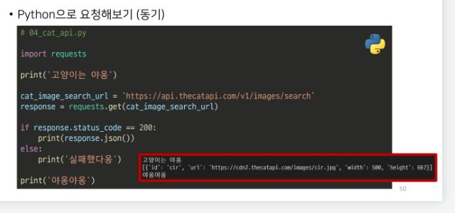
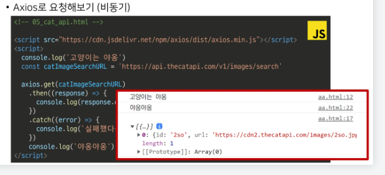
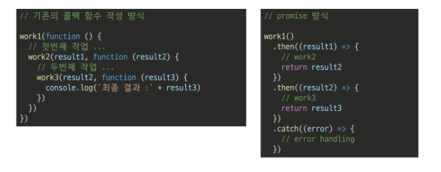
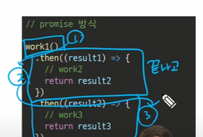

# 05_JavaScript_비동기처리

## 동기(Synchronous)

> 동기(Synchronous)

- 모든 일을 순서대로 하나씩 처리하는 것

- 순서대로 처리한다 == 이전 작업이 끝나면 다음 작업을 시작한다

- 우리가 작성한 Python 코드가 모두 동기식

- 요청과 응답을 동기식으로 처리한다면?
  
  - 요청을 보내고 응답이 올때까지 기다렸다가 다음 로직을 처리

---

## 비동기(Asynchronous)

> 비동기(Asynchronous)
> 
> - <mark>기다리지 않는다</mark>

- 작업을 시작한 후 결과를 기다리지 않고 다음 작업을 처리하는 것(병렬적 수행)

- 시간이 필요한 작업들은 요청을 보낸 뒤 응답이 빨리 오는 작업부터 처리

- 예시 ) Gmail에서 메일 전송을 누르면 목록 화면으로 전환되지만 실제로 메일을 보내는   작업은 병렬적으로 뒤에서 처리됨

> 비동기 사용 이유

- 사용자 경험
  
  - 아주 큰 데이터를 불러온 뒤 실행되는 앱이 있을 때, 동기로 처리한다면 데이터를 모두 불러온 뒤에야 앱의 실행 로직이 수행되므로 사용자들은 마치 앱이 멈춘 것과 같은 경험을 겪게 됨
  
  - 동기식 처리 => 특정 로직이 실행되는 동안 다른 로직의 실행을 차단
    
    => 프로그램이 동작하지 않는것 처럼 보임
  
  - 비동기처리 => 먼저 처리되는 부분부터 보여줄 수 있음
    
    사용자 경험에 긍정적 효과를 볼 수 있음

---

## JavaScript의 비동기 처리

> Single Thread 언어, JavaScript

- <mark>JavaScirpt 는 한 번에 하나의 일만 수행할 수 있는 Single Thread 언어</mark>로 동시에 여러작업을 처리할 수 없음

`[참고]Thread란?`

`작업을 처리할 때 실제로 작업을 수행하는 주체, multi-thread라면 업무를 수행할 수 있는 주체가 여러 개라는 의미`

- JavaScript는 하나의 작업을 요청한 순서대로 처리할 수 밖에 없다.

---

> JavaScript Rintime

- 자바스크립트 자체는 싱글스레드 이므로 비동기 처리 불가 >> 따로 도와주는 환경이 필요

- 특정 언어가 동작할 수 있는 환경을 "런타임" 이라 함

- 자바스크립트에서 <mark>비동기와 관련한 작업은 브라우저 또는 Node환경 에서 처리</mark>

- 이중에서 브라우저 환경에서의 비동기 동작은 크게 아래의 요소들로 구성됨
  
  1. JavaScript Engine의 Call Stack
  
  2. Web API
  
  3. Task Queue
  
  4. Event Loop

---

> 비동기 처리 동작 방식

- 브라아주 환경에서의 JavaScript의 비동기는 아래와 같이 처리한다.
1. 모든 작업은 Call Stack(LIFO)으로 들어간 후 처리된다.

2. 오래 걸리는 작업이 Call Stack으로 들어오면 <mark>Web API로 보내 별도로 처리</mark>한다.

3. Web API에서 <mark>처리가 끝난 작업들은</mark> 곧바로 Call Stack으로 들어가지 못하고 <mark>Task Queue(FIFO)에 순서대로 들어간다.</mark>

4. Event Loop가 Call Stack이 비어 있는 것을 계속 체크하고 <mark>Call Stack이 빈다면 Task Queue에서 가장 오래된(가장 앞에있는) 작업을 Call Stack으로 보낸다.</mark>

---

> 비동기 처리 동작 요소

1. Call Stakc(알바)
   
   - 요청이 들어올 때 마다 순차적으로 처리하는 Stack(LIFO)
   
   - 기본적인 자바스크립트의 싱글스레드 작업 처리

2. Web API(주방)
   
   - 자바스크립트의 엔진이 아닌 브라우저에서 제공하는 runtime 환경
   
   - 시간이 소요되는 작업을 처리(setTimeout, DOM Event, AJAX요청 등)

3. Task Queue(대기열)
   
   - 비동기 처리된 Callback 함수가 대기하는 Queue(FIFO)

4. Event Loop(사장님)
   
   - Call Stack 과 Task Queue를 지속적으로 모니터링
   
   - Call Stack이 비어있는지 확인 후 비어 있다면 Task Queue에서 대기중인 오래된 작업을 Call Stack에서 Push

> 정리

- 자바스크립트는 한 번에 하나의 작업을 수행하는 싱글스레드 언어로 동기적 처리를 한다
  
  근데 브라우저 환경에서는 Web API에서 처리된 작업이 지속적으로 Task Queue를 거쳐 Event Loop에 의해 Call Stack에 들어와 순차적으로 실햄됨으로써 비동기 작업이 가능한 환경이 된다.

---

## Axios

> Axios

- JavaScript의 HTTP 웹 통신을 위한 라이브러리

- 확장 가능한 인터페이스와 쉽게 사용할 수 있는 비동기 통신 기능을 제공

- node 환경은 npm을 이용해서 설치 후 사용할 수 있고, browser 환경은 CDN을 이용해서 사용할 수 있음

---

> Axios 사용해보기

- get, post등 여러 method 사용가능

- then 을이용해서 성공하면 수행할 로직작성

- catch를 이용해서 실패하면 수행할 로직작성

- finaly 무조건 실행할 로직작성

```javascript
<script>
  axios.get('요청할 url')
    .then(성공시 수행할 콜백함수)
    .catch(실패시 수행할 콜백함) // 에러메시지 출력에 많이 사용
</script>
```

`>> 파이썬의 try - catch 문과 비슷`

동기식 처리



비동기식 처리



> [정리]

- axios는 비동기로 데이터 통신을 가능하게 하는 라이브러리

- 같은 방식으로 우리가 배운 Djanog REST API로 요청을 보내서 데이터를 받아온 후 처리할 수 있음

---

## Callback 과 Promise

> 비동기 처리의 단점

- 작업이 완료되는 순서에 따라 처리되는게 비동기 처리

- 이는 코드의 순서가 불명확해 실행 결과를 예상하며 코드를 작성할 수가 없다.

- 이를 해결하기 위해 콜백 함수를 사용

---

## Callback 함수

> 콜백 지옥

- 콜백 함수는 연쇄적으로 발생하는 비동기 작업을 순차적으로 동작할 수 있게 함

- 보통 어떤 기능의 실행 결과를 받아 다른 기능을 수행하기 위해 많이 사용하는데, 이 과정을 작성하다 보면 비슷한 패턴이 계속 발생

- 비동기 처리를 위한 콜백을 작성할 때 마주하는 문제를 콜백 지옥이라 하며 코드 작성형태가 피라미드 같아서 파멸의 피라미드라고도 부름

`콜백 지옥은 코드의 가독성을 해치고 유지 보수가 어렵다`

---

## Promise(프로미스)

> 프로미스

- Callback Hell 문제를 해결하기 위해 등장한 비동기 처리를 위한 객체

- 비동기 작업의 완료 또는 실패를 나타내는 객체

- 성공에 대한 약속 then()

- 실패에 대한 약속 catch()

> then & catch

- then(callback)
  
  - 요청한 작업이 성공하면 callback 실행
  
  - 이전 작업의 성공 결과를 인자로 전달 받음

- catch(callback)
  
  - then()이 하나라도실패하면 callback 실행
  
  - 이전 작업의 실패 객체를 인자로 전달 받음

- then과 catch 모두 항상 promise 객체를 반환
  
  즉, 계속해서 chaining 할 수 있음

- axios로 처리한 비동기 로직이 항상 promise 객체를 반환



---

> promise가 보장하는 것(vs 비동기 콜백)

- 비동기 콜백 작성 스타일과 달리 promise가 보장하는 특징
1. Event Loop가 이전 callback을 완료하기 전에는 절대 호출되지 않음

2. 비동기 작업이 성공하거나 실패한 뒤에 .then() 메서드를 추가해도 1번과 똑같이 동작

3. .then()을 여러번 사용해서 여러개의 callback 함수 사용 가능

`파이썬 코드처럼 순차적으로 실행시켜줌`


