# 06_JavaScript_비동기처리_with_Django

## AJAX

> AJAX (Asynchronous JavaScript And XML) - 비동기식 JavaScript와 XML

- 비동기 통신을 이용하면 화면 전체를 새로고침 하지 않아도 서버로 요청을 보내고, 데이터를 받아 화면의 일부분만 업데이트 가능

- 비동기 통신 웹 개발 기술 `>>>` AJAX

- Axios가 비동기 웹 통신을 위한 라이브러리

> AJAX 특징

- 페이지 전체를 reload(새로고침)를 하지 않고서도 수행되는 비동기성

- 서버의 응답에 따라 전체 페이지가 아닌 일부분만을 업데이트 할 수 있음
1. 페이지 새로고침 없이 서버에 요청

2. 서버로부터 응답(데이터)을 받아 작업을 수행

---

## 비동기 적용하기

> 팔로우

- 각각의 템플릿에서 script 코드를 작성하기 위한 block tag 영역 작성
1. axios CDN 작성

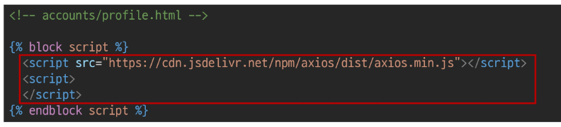

2. form의 기본속성 지워주고 id 값 설정

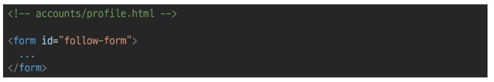

3. JavaScript에서 form 골라오기

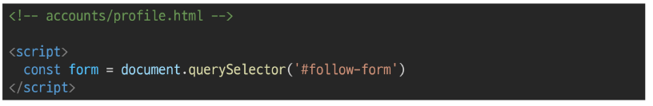

4. form에 이벤트 요소 추가 및 제출 이벤트 작성

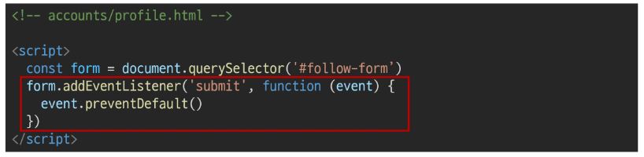

5. axios 요청
   
   > [참고]
   
   - url 작성시 빽틱(``) 으로 작성 후 **${}** 에 f스트링 함수처럼 작성
   
   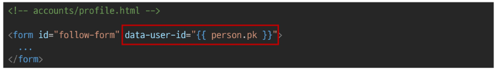
   
   - url의 달라지는 부분은 form에서 데이터를 넘겨줄때 해당 url이 필요로하는 pk 혹은 username을 넘겨주고 JavaScript로 선택해주기
   
   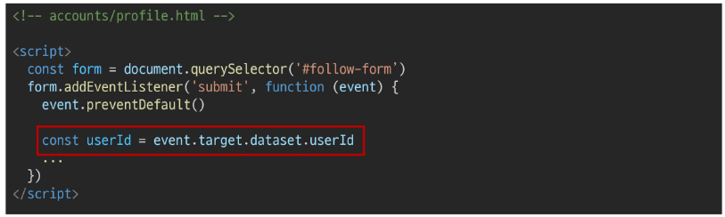

> 이부분이 `data-*arrributes` 속성임
> 
> 사용자 지정 데이터 특성을 만들어 임의의 데이터를 HTML과 DOM 사이에서 교환할 수 있는 방법
> 
> - HTML에서 data-user-id 로 넘겨주면 DOM에서 userId 로 접근이 가능함
> 
> - 접근시 dataset 속성을 이용해 접근
> 
> - [주의]
>   
>   - 대소문자 여부에 상관없이 Xml로 시작하면 안된다.
>   
>   - 세미콜론 포함하면 안됨
>   
>   - 대문자 포함 X

    url완성하기

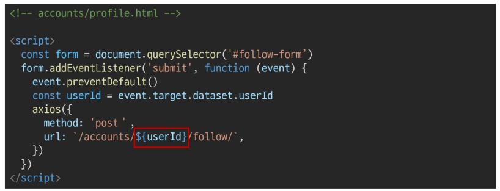

6. csrf토큰 작성
   
   - 숨겨진 csrf 토큰값을 가진 input 태그 선택하기

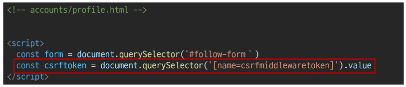

7. AJAX로 csfrtoken 보내기
   
   - 선택한 csrftoken을 headers에 작성
   
   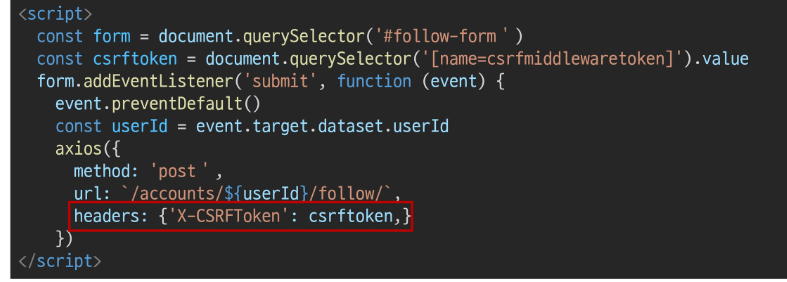

8. follow 여부 확인을 위해 is_followed 변수 작성 및 json 응답 받아오기
   
   - 응답 받기위해 context에 is_followed 담아서 넘겨주기

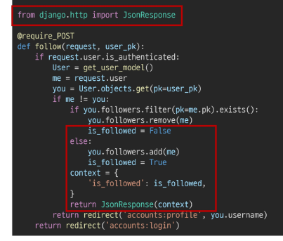

9. axios의 .then 부분 작성해줄거
   
   - view함수에서 응답한 is_followed를 사용해 버튼 토글해줄거
   
   - 또 조건문에 따라 표시 형식 구분해줄것
   
   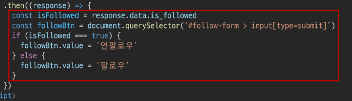

이까지 작성해 주면 팔로우 언팔로우의 버튼이 바뀌는거 까지는 구현이 되는데 화면에 표시되는 팔로우 숫자가 안바뀜

---

> ## 팔로우 숫자 바꿔주기

1. 팔로우 / 언팔로우 직접적으로 선택 가능하게

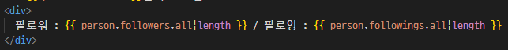

해당 부분을 span 태그로 묶어서 id값 지정해주기

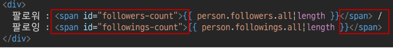

2. 작성한 span 태그 선택해주기

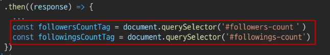

3. view 함수에 팔로워 / 팔로잉 정보 context에 담아서 넘겨주기

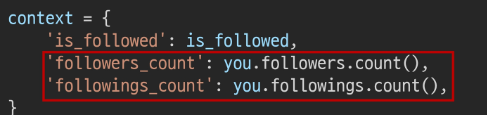

- 이렇게 작성이 가능한 이유?
  
  `models.py에 following 과 역참조 모델의 이름을 followers로 정의해 둬서 해당 문자 그대로 접근하여 사용이 가능함`
4. 넘겨준 파일 JavaScript로 선택하여 innerText 채워주기

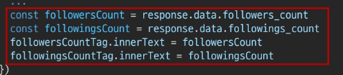
