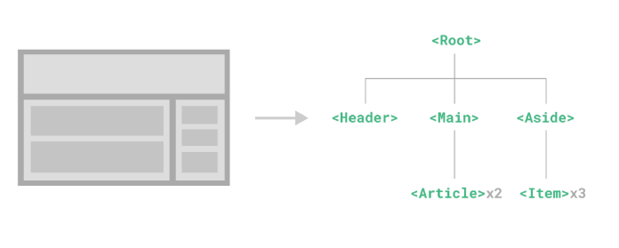

# Vue CLI

설치하기

> node 18.6 LTS 설치하기
> 
> VScode 에 Vue CLI 설치하기


- 설치
  
  `npm install -g @vue/cli`

- 프로젝트 생성
  
  `vue create vue-cli`

- 버전선택
  
  `vue2`

- 디렉토리 이동
  
  `cd vue-cli`

- 프로젝트 실행
  
  `npm run serve`

---

> ## Babel

- JS의 ES6+ 코드를 구버전으로 번역/변환 해주는 도구

- JS의 파편화 표준화 영향으로 작성된 코드의 스펙트럼이 매우 다양

- Babel 예시

---

> ## Webpack

- static module bundler

- 이런게 있다

---

> ## Module

- 개발하는 애플리케이션의 크기가 커지고 복잡해지면 파일 하나에 모든 기능을 담기가 어려워짐

- 자연스럽게 파일을 여러 개로 분리하여 관리를 하게 되었고 이때 분리된 파일 각각이 모듈(module)즉 js 파일 하나가 하나의 모듈

- 기능 단위로 분리

> Module 의존성 문제

- 모듈의 수가 많아지고 라이브러리 혹은 모듈 간의 의존성(연결성)이 깊어지면서 특정한 곳에서 발생한 문제가 어떤 모듈 간의 문제인지 파악하기 어려움
  
  - Webpack은 이 모듈 간의 의존성 문제를 해결하기 위해 등장

---

> ## Component

- UI를 독립적이고 재사용 가능한 조각들로 나눈것
  
  - 기능별로 분화한 코드 조각

- 컴포넌트는 유지보수를 쉽게 만들어 줄 뿐만 아니라 재사용성의 측면에서도 매우 강력한 기능을 제공



---

> ## Component based architecture 특징

- 관리가 용이
  
  - 유지/보수 비용 감소

- 재사용성

- 확장가능

- 캡슐화

- 독립적

---

> ## vue component

- 하나의 파일 하나의 컴포넌트 트리구조 로 이루어진다.

- HTML - JavaScript - CSS 가 한페이지에 구성

---

> ## Vue component 실습

- Vue CLI를 실행하면 이미 HelloWorld.vue라는 컴포넌트가 생성되어 있고 App.vue에 등록되어 사용됨
  
  => `기본구조`

---

- 새로운 component 생성
  
  1. src/components/ 안에 생성
  
  2. script에 이름 등록
  
  3. template에 요소 추가


- 기본 구조로 div 루트 하나는 추가하는게 좋음

- templates 안에 반드시 하나의 요소만 추가 가능 2개의 루트요소 사용 불가

- 비어 있어도 안되고 해당 요소 안에 추가 요소를 작성해야 한다.

---

- 새로운 component 등록 
  
  1. 불러오기
  
  2. 등록하기
  
  3. 보여주기


component 등록 - 불러오기

- `import {instance name} from {위치}`

- `@는 src의 shortcut` / .vue 는 생략가능

component 등록 - 등록하기

- srript 에 export default 부분에 component : {instance name} 등록하기

component 등록 - 보여주기

- 닫는 태그만 있는 요소처럼 사용
  
  로고와 기존 컴포넌트 사이에 위치

---

파일의 CSS 적용시 전체 CSS에 적용시키는 것과 부분부분에 적용시키는 CSS가 달라질때

scoped 요소를 이용하여 작성

```cshtml
<style scoped>
h3 {
    margin: 40px 0 0;
}
</style>
```

이런식으로 style에 scoped로 해당 영역만 스타일 지정이 가능해짐
