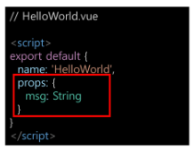
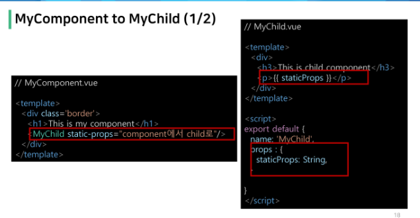
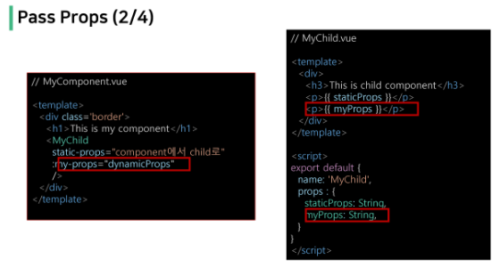
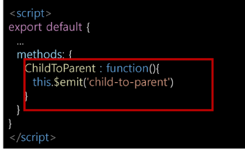
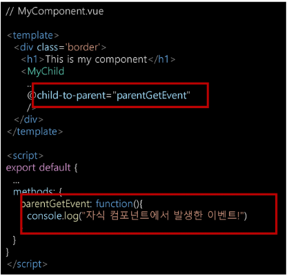
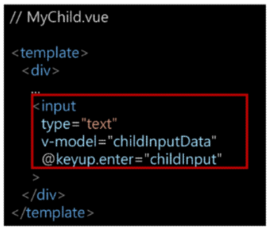
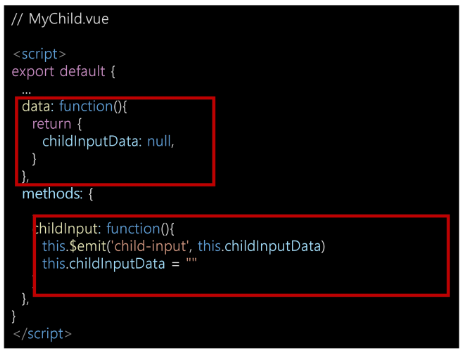
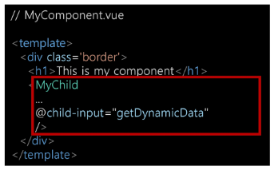
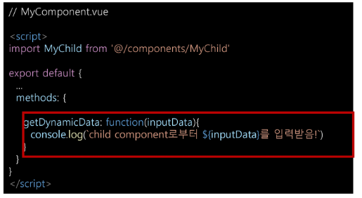

# Vue Data Management

- 동적 웹페이지에서 다뤄야 할 데이터의 등장

- User Data, 게시글 Data 등등등

- 한 페이지 내에서 가은 데이터를 공유함
  
  - MyComponent에 정의된 data를 MyChild에서 사용하려면 어떻게 해야 할까

---

> Data in components

- MyChild에도 똑같은 data를 정의
  
  - MyComponent의 data와 MyChild의 데이터가 동일한 data가 맞는가?
  
  - MyComponent의 data가 변경된다면 MyChild도 같이 변경이 될까?
  
  - 각 Component는 독립적 이므로 서로 다른 data를 갖게 될 것

- 필요한 컴포넌트들 끼리 데이터를 주고받기
  
  - 데이터의 흐름을 파악하기 힘듦
  
  - 개발 속도 저하
  
  - 유지보수 난이도 증가

- 컴포넌트는 부모-자식 관계를 가지므로 부모-자식 관계만 데이터를 주고받게 하기
  
  - 데이터의 흐름을 파악하기 용이
  
  - 유지 보수 쉬움

---

> pass props & emit event

- 부모 => 자식으로의 데이터의 흐름
  
  - pass props의 방식

- 자식 => 부모로의 데이터의 흐름
  
  - emit event의 방식

---

> Pass Props

- 요소의 속성(property)을 사용하여 데이터 전달

- props는 부모(상위) 컴포넌트의 정보를 전달하기 위한 사용자 지정 특성

- 자식(하위) 컴포넌트는 props 옵션을 사용하여 수신하는 props를 명시적으로 선언해야 함

---

> props in HelloWorld

- Vue CLI를 설치할 때 만들어주던 App.vue의 HelloWorld 컴포넌트를 살펴보면 msg라는 property가 작성되어 있음

- HelloWorld.vue 에서 msg를 사용한 것을 App.vue에서 property로 넘긴 msg가 출력되는 것을 확인할 수 있음

---

> Pass Props

- 부모 => 자식 으로 data를 전달 하는 방식

- 정적인 데이터를 전달하는 경우 static props 라고 명시하기도 함

- 요소에 속성을 작성하듯이 사용 가능하여,
  
  <mark>prop-data-name="value" </mark>의 형태로 데이터를 전달
  
  - 이때 속성의 키 값은 kebab-case를 사용

- prop 명시

- 데이터를 받는 쪽, 즉 하위 컴포넌트에서도 props에 대해 명시적으로 작성 해주어야 함

- 전달받은 props를 type과 함께 명시

- 컴포넌트를 문서화 할 뿐만 아니라, 잘못된 타입이 전달되는 경우 브라우저의 자바스크립트 콘솔에서 사용자에게 경고

- 

---

- 보내줄 부모 쪽에서 static-props 작성하여 데이터를 직접 작성하여 넘겨줌

- 받는 자식쪽에서 props를 받은 후 template에 작성

---

- 부모에서 넘겨주는 props
  
  - kebab-case(중간에 하이픈 들어가는거)

- 자식에서 받는 props
  
  - camelCase

---

> Dynamic props

- 변수를 props로 전달할 수 있음

- v-bind directive를 사용해 데이터를 동적으로 바인딩

- 부모 컴포넌트의 데이터가 업데이트 되면 자식 컴포넌트로 전달되는 데이터 또한 업데이트 됨

---

> 컴포넌트의 data 함수

- 각 vue 인스턴스는 같은 data 객체를 공유하므로 새로운 data 객체를 반환(return)하여 사용해야 함

---

> Pass Props

- :dynamic-props="dynamicProps"는 앞의 key값(dynamic-props)이란 이름으로
  
  뒤의 dynamicProps를 전달한다는 뜻

- key값을 바꾸면 자식에서 받는 key값의 이름을 camelCase로 바꿔줘야 함

---

> 단방향 데이터흐름

- 모든 props는 부모에서 자식으로 즉 아래로 단방향 바인딩을 형성

- 부모 속성이 업데이트 되면 자식으로 흐르지만 반대 방향은 아님
  
  - 부모 컴포넌트가 업데이트될 때마다 자식 컴포넌트의 모든 prop들이 최신 값으로 새로고침 됨

- 목적
  
  - 하위 컴포넌트가 실수로 상위 컴포넌트 상태를 변경하여 앱의 데이터 흐름을 이해하기 힘들게 만드는 것을 방직

=> 하위 컴포넌트에서 prop를 변경하려고 시도해서는 안되며 그렇게 하면 vue는 콘솔에서 경고를 출력함

---

> Emit Event

- 부모 컴포넌트에서 자식 컴포넌트로 데이터를 전달할 때는 이벤트를 발생 시킴
  
  1. 데이터를 이벤트 리스너의 콜뱀함수의 인자로 전달
  
  2. 상위 컴포넌틑는 해당 이벤트를 통해 데이터를 받음

---

> $emit

- $emit 메서드를 통해 부모 컴포넌트에 이벤트를 발생
  
  - $emit('event-name') 형식으로 사용하며 부모 컴포넌트에 event-name이라는 이벤트가 발생했다는 것을 알림
  
  - 마치 사용자가 마우스를 클릭 하면 click 이벤트가 발생한 것처럼 $emit('event-name')가 실행되면 event-name 이벤트가 발생하는 것

---

> Emit Event

1. 자식 컴포넌트에 버튼을 만들고 클릭 이벤트 추가
   
   `<button @click="ChildToParent">클릭!</button>`

2. $emit을 통해 부모 컴포넌트에게 child-to-parent 이벤트를 넘겨주기
   
   
   
   => JS에서 HTML로 넘겨주기 때문에 kebab-case로 넘겨줘야 함

3. emit된 이벤트를 상위 컴포넌트에서 청취 후 핸들러 함수 실행
   
   `<하위컴포넌트이름 @child-to-parent="parentGetEvent"/>`
   
   

---

> [정리]

- 자식에서 부모에게 이벤트를 넘겨줄 것

- 그러기 위해서는 이벤트를 정의해줌

- 이벤트를 정의하여 이벤트 발생시켜줌 => `methods`

- 발생한 이벤트에서 부모 컴포넌트에게 이벤트를 발생시킬거니 methods에서 이벤트 발생시 emit을 이용하여 부모에게 접근 이때 이벤트를 받는 곳은 HTML이니 kebab-case를 지켜 넘겨줄 이벤트 정의함

- 부모 컴포넌트에서 이벤트를 청취 =>`@` 시 발생시킬 이벤트 정의 => `methods`

- 이벤트에 따라 발생할 상황 작성

---

> emit with data

- 이벤트를 발생(emit)시킬 때 인자로 데이터를 전달 가능
  
  => `methods에서 이벤트 발생시 넘겨주는 kebab-case 뒤에 , 로 넘겨줄 데이터 추가해주기`

- 넘겨받은 데이터를 부모 컴포넌트에서 함수에 정의해서 넘겨받을 수 있음
  
  `parentGetEvent: function(inputData) {}` => inputData - 자식에게 넘겨받은 데이터

---

> 동적인 데이터 전달하기

- 양방향 통신을 할 것이니 v-model 사용
  
  

- 양방향 통신하며 엔터기를 눌렀다 떼는순간 데이터를 넘겨줄 것이니 keyup시 이벤트를 넘겨줌

- childInput 함수를 실행시켜 childInputData 입력시켜주기
  
  

- 그리고 그 결과를 부모에게 넘겨줌 그럼 부모는 해당 데이터를 받아서 다시 출력해야함
  
  

- emit에 넘겨주는 데이터는 child-input 으로 넘겨주니 부모에서 child-input을 들으면 getDynamicData 함수 실행
  
  

---

# LifeCycle Hooks

> Lifecycle Hooks

- 각 Vue 인스턴스는 생성과 소멸의 과정 중 단계별 초기화 과정을 거침
  
  - Vue 인스턴스가 생성된 경우, 인스턴스를 DOM에 마운트하는 경우,
    
    데이터가 변경되어 DOM를 업데이트하는 경우 등

- 각 단계가 트리거가 되어 특정 로직을 실행할 수 있음

- 이를 Lifecycle Hooks 라고함

---

> Lifecycle Hooks 단계

1. created

2. mounted

3. updateed

4. desrtoyed
