# Vuex Advanced

- Vuex로 관리중이 상태(데이터)를 로컬에 저장하기

---

## Local Storage

> 상태 유지하기

- 새로고침 했을때 페이지 초기화 되는거 막는법

---

> Window.localStorage

- 브라우저의 내장 객체 중 하나

- Key - Value 형태로 데이터를 저장

- 브라우저를 종료해도 계속 유지된다.
  
  - 다른 탭에서도 동일한 데이터를 공유 가능
  
  - 다른 도메인에서는 접근 불가

- setItem 으로 데이터 저장(key, value)
  
  - 저장은 무조건 문자열로만 들어감
  
  - stringify 사용해서 JSON 타입으로 형변환한뒤 setItem으로 저장하면 문자열이 아닌 다른 형식으로도 저장이 된다.

- getItem 으로 데이터 불러오기(key, value)
  
  - 불러올때 JSON.parse() 사용해서 원하는 타입으로 불러올 수 있음

---

저장 및 불러오기 순서

1. 정의 및 저장
   
   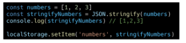

2. 불러오기
   
   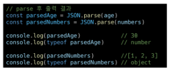

이거 장바구니에 담거나 쇼핑목록 저장할때 자주사용된다함

최종플젝때 테마 지정해서 테마 저장하는 용도로 써도 될듯

---

> vuex-persistedstate 플러그인

vuex store의 상태를 브라우저 local storage에 저장해 주는 플러그인

1. npm에 install 먼저해주기

    `npm install vuex-persistedstate` 

2. index.js 에 import 추가

    `import createPersistedState from 'vuex-persistedstate'`

3. 플러그인추가
   
   ```javascript
   export default new Vuex.Store({
   
     plugins: [
   
       createPersistedState (),
   
     ],
   ```

주의할점 plugins 은 {} 가 아닌 [] 로 작성해 줘야함

이건 자동저장이라 만약 수동저장 할 일이 있다면 앞선 방법도 알아야 함

---

## Vuex Binding Helper

- Vuex store의 state, mutations, actions 등을 간단하게 사용할 수 있도록 만들어진 헬퍼 함수

- mapState, mapActions 와 같은 형식으로 사용

- 사용하기위해 import 받아와야 함
  
  `import {mapState, mapActions} from 'vuex'`

---

> mapState

- vuex store의 상태를 컴포넌트의 데이터에 매핑할 때 사용

- 객체 혹은 배열 형태로 상태를 매핑하여 사용 할 수 있음

- 그대로 쓸때는 배열 이름바꾸거나 추가기능 넣을때는 객체로 사용한다.
1. import 받아오기
   
   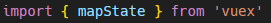

2. 스프레드 오퍼레이터를 이용해 작성
   
   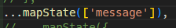
   
   지금 message를 바꾸거나 하지 않고 그대로 message로 사용할 것이기 때문에 배열형태로 작성
- 만약 이름을 바꿔서 사용하고싶다면 객체형식으로 작성
  
  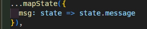

---

> mapActions

- 마찬가지로 그대로 쓸거면 배열 바꿔서 쓸거면 객체
1. import 받아오기
   
   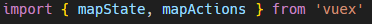

2. 스프레드 오퍼레이터 이용해서 작성
   
   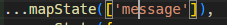

3. 함수실행할때 데이터 같이 넘겨주기
   
   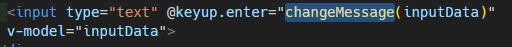

근데 이렇게만 작성하면 input 에 들어가는 값이 지워지지가 않음 그럴땐?

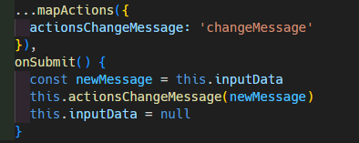

이런식으로 ...mapActions를 메서드로 정의한 후 아래에 onSubmit 이란 메서드를 새로이 정의하면서 actionsChangeMessage를 불러와서 사용 그럼 input 넘겨줄때 onSubmit을 실행시키면 되니까 데이터 같이 넘겨줄 필요가 없어짐

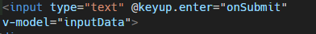

---

## modules

- Vuex store를 여러 파일로 나눠서 관리 할 수 있게 해주는 기능

- 파일분리

- store의 가독성을 향상시킬 수 있음
1. store에 modules 추가

2. modules에 myModule 추가

3. state, mutations, actions, getters 등 내가 사용할 것 여기에 작성

4. index.js 에 modules 추가 
   
   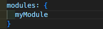
