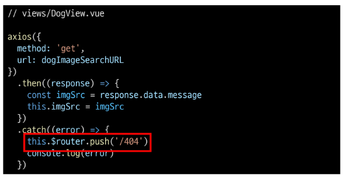

# Vue

> 네비게이션 가드

- Vue router를 통해 특정 URL에 접근할 때 다른 url로 redirect를 하거나 해당 URL로의 접근을 막는 방법

- 사용자 인증 정보가 없으면 특정 페이지에 접근하지 못하게 함

---

## 전역가드

> Global Before Guard

- 애플리케이션 전역에서 동작

- 다른 url 주소로 이동할 때 항상 실행

- router.beforeEach()를 사용하여 설정
  
  - to : 이동할 URL 정보가 담긴 Route
  
  - from : 현재 URL 정보가 담긴 Route
  
  - next : 지정한 URL로 이동하기 위해 호출하는 함수
    
    - 반드시 1번만 호출

- URL이 변경되어 화면이 전환되기 전 router.beforeEach()가 호출됨
  
  - 화면이 전환되지 않고 대기 상태가 됨

- 변경된 URL로 라우팅하기 위해서는 next()를 호출해줘야 함
  
  - next() 호출전까지 화면전환 X

[참고]

로그인 여부 물어보는 방법

로그인 여부에 따른 라우팅 처리

로그인 여부 물어볼 때 authPages로 로그인 해야지만 보여줄 페이지를 지정해 주고 있는데

allowAllPages로 로그인 안되면 보여줄 페이지를 지정해서 !로 값을 반대로 돌려서 보여줄 수 도 있다

---

> ## 라우터 가드

- 전체 route가 아닌 특정 route에 대해서만 가드를 설정하고 싶을 때 사용

- route.beforeEnter()

- 라우터에 진입했을 때 실행

- 라우터를 등록한 위치에 추가

라우터 설정 페이지에 바로 작성

---

> ## 컴포넌트 가드

- 특정 컴포넌트 내에서 가드를 지정하고 싶을 때 사용

- beforeRouteUpdate()
  
  - 해당 컴포넌트를 렌더링하는 경로가 변경될 때 실행

---

> ## 404 Not Found

- 사용자가 요청한 리소스가 존재하지 않을 때 응답

리소스가 없다는것을 직접 요청한 경우가 위에 사진임

리소스가 존재하지 않을때 404로 이동하기 위해서는 routes 최하단부에 에스터리스크`(*)` 로 path 지정해서 redirect 시켜주면 된다.

---

> axios 요청을 통한 404

- Django에게 articles/1/ 로 요청을 보냈는데 1번 게시글이 삭제된 상태인 경우
  
  - path: '*'을 만나 404page가 렌더링 되는게 아니라 articles/:id/ 에 대한 components가 렌더링 되는데 아무 데이터가 존재하지 않아서 빈 페이지가 렌더링 됨

==> 리소스 형식은 유효한데 데이터가 없어서 빈페이지를 반환

axios 요청으로 실습하기

- DogAPI로 실습

- axios 요청 보낼때 url 주소에 `` 빽틱 써서 품종별로 들고오기

이미지가 없는 경우 즉 품종이 없는경우${breed} 에 들어갈 data가 틀린경우 빈페이지가 로딩되므로 이 경우를해결해 줘야함

axios 요청의 catch에서 오류구문 처리해주기

요청보낸 breed가 route의 params 이므로 해당 params의 breed가 없으면 오류구문으로 없는 품종이라고 출력

여기서 axios 요청이 실패한 경우 404페이지로 렌더링 시킬 수도 있다.

