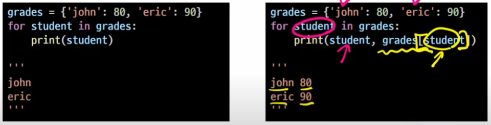
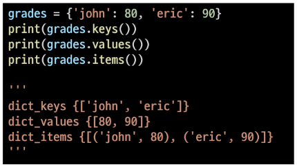
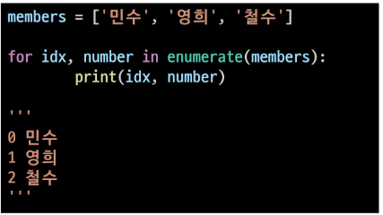
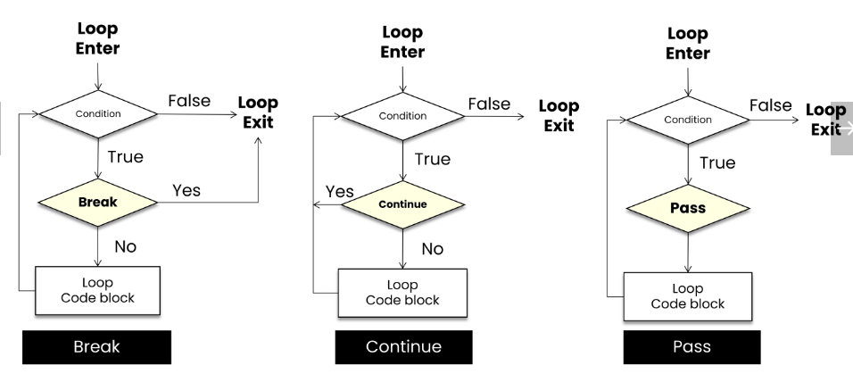

# python_02

> ## 제어문
> 
> - 항상 순차, 선택, 반복의 구조로 이루어짐
>   
>   - 순차 > 위에서 아래로 흐르는 구조
>   
>   - 특정 상황에 따라 코드를 선택적으로 실행(분기/조건) 하거나 반복하는 제어가 필요함

## 1. 코드 스타일 가이드

- 파이썬에서 제안하는 스타일 가이드 - PEP8

- 각 회사/프로젝트마다 따로 스타일 가이드를 설정하기도 함 - google style guide

> ### 들여쓰기
> 
> - 문장을 구분할때 들여쓰기를 사용
> 
> - 한 코드 안에서는 반드시 한 종류의 들여쓰기를 사용 > 혼용금지
>   
>   - 탭으로 하면 계속 탭으로

## 2. 조건문

- 참/거짓을 판단할 수 있는 조건식과 함께 사용
  
  - 순서도를 작성 후 순서도 대로 코드 작성
  
  - 우리의 생각을 가시화(순서도) 후 코드를 작성하면 작성 속도와 효율이 좋음
    
    - else는 필수가 아님
  
  - ```python
    if 조건 == True:
        #run this code block
    else:
        #run this code block
    
    # ex
    a=5
    if a > 5:
        print('5초과')
    else:
        print('5이하')
    print(a)
    
    #조건문 실습 문제
    # 조건문을 통해 num의 값이 홀수인지 짝수인지 판별
    # num은 input을 통해 사용자로부터 입력 받으시오
    num = int(input())
    if num % 2 == 0
        print('짝수')
    else num:
        print('홀수')
    ```
    
    `if num % 2` 
    
    0은 대표적은 false 값 나누기 2의 나머지가 0이 아니라면 true가 반환되니 비교없이도 true/false 판단이 가능

- 복수 조건문
  
  - `elif` 를 활용
    
    - ```python
      if 조건:
          # code block
      elif 조건:
          # code block
      elif 조건:
          # code block
      else:
          # code block
      ```
    
    - 복수 조건문 실습 문제
      
      - 미세먼지 농도에 따른 출력문 변경
        
        ```python
        dust = 80
        if dust > 150:
            print('매우 나쁨')
        elif dust > 80:
            print('나쁨')
        elif dust > 30:
            print('보통')
        else:
            print('좋음')
        print('미세먼지 확인 완료!')
        # 보통
        # 미세먼지 확인 완료!
        ```

- 중첩 조건문
  
  - 조건문 안에 다른 조건문을 중첩되어 사용
    
    - 들여쓰기에 유의하여 작성
      
      ```python
        dust = 500
        if dust > 150:
            print('매우 나쁨')
                if dust > 300:
                    print('실외 활동을 자제하세요.')
        elif dust > 80:
            print('나쁨')
        elif dust > 30:
            print('보통')
        elif dust >= 0:
            print('좋음')
        else:
            print('값이 잘못 되었습니다.')
      ```

- 조건 표현식
  
  - 일반적으로 조건에 따라 값을 정할 때 활용
  
  - 삼항 연산자로 부름
    
    - `value = num if num >=0 else - num`
    
    - 절댓값을 저장하기 위한 코드
    
    - 콜론 안넣어도 돌아감
      
      ```python
      num = 2
      result = '홀수입니다' if num % 2 else '짝수입니다'
      print(result)
      # 짝수입니다.
      
      num = -5
      value = num if num >= 0 else 0
      print(value)
      
      if num >= 0:
          value = num
      else :
          value = 0
      print(value) # 0
      ```

## 3. 반복문

1. while 문(조건을 알때)
   - 종료 조건에 해당하는 코드를 통해 반복문을 종료시켜야 함
2. for 문(반복 횟수를 알때)
   - 반복가능한 객체를 모두 순회하면 종료(별도의 조건 필요 없음)
- 반복 제어
  - break, continune, for-else

### while문

- 조건식이 참인 경우 반복적으로 코드를 실행
  
  - 조건이 참인 경우 들여쓰기 되어 있는 코드 블록이 실행됨
  
  - 코드 블록이 모두 실행되고, 다시 조건식을 검사하며 반복적으로 실행됨
  
  - 무한 루프 하지 않도록 종료 조건이 반드시 필요
  
  while문 예시
  
  ```python
  a = 0
  while a < 5
      print('a')
      a += 1
  print('끝')
  ```
  
  - 복합연산자
    
    - 연산과 할당을 합쳐놓은것
    
    - `+=, -=` ,, 형식으로 작성

### for 문

- 처음부터 끝까지 모두 순회하므로 별도의 종료 조건이 필요하지 않음
  
  - `for변수명 in iterable:` 형식으로 작성
  
  - ```python
    for fruit in ['apple','mango','banana']:
        print(fruit)
    print('끝')
    # apple
    # mango
    # banana
    # 끝
    ```

- 딕셔너리 순회
  
  - 딕셔너리는 기본적으로 key를 순회하며, key를 통해 값을 활용
  
  - 
  
  - 추가 메서드를 활용하여 순회할 수 있음
    
    - keys(): key로 구성된 결과
    
    - values(): valus로 구성된 결과
    
    - items(): (key, value)의 튜플로 구성된 결과
    
    - 
  
  - enumerate 순회
    
    - enumerate()
      
      - 인덱스와 객체를 쌍으로 담은 열거형 객체 반환
        
        - (index, value) 형태의 튜플로 구성된 열거 객체를 반환
      
      
      
      ```python
      members = ['민수','영희','철수']
      enumerate(members)
      print(list(enumerate(members))) 
      # [(0, '민수'), (1, '영희'), (2, '철수')]
      print(list(enumerate(members, start=1))) 
      # [(1, '민수'), (2, '영희'), (3, '철수')]
      ```

- list comprehension

- dictionary comprehension
  
  - 표현식과 제어문을 통해 특정한 값을 가진 리스트를 간결하게 생성하는 방법
  
  - `[code for 변수 in iterable]`
  
  - `[code for 변수 in iterable if 조건식]`

### 반복문 제어

> - break
>   
>   - 반복문을 종료
> 
> - continue
>   
>   - continue 이후의 코드 블록은 수행하지 않고, 다음 반복을 수행
> 
> - for-else
>   
>   - 끝까지 반복문을 실행한 이후에 else 문 실행
>     
>     - break를 통해 중간에 종료되는 경우 else문은 실행 안댐
> 
> - pass
>   
>   - 코드작성할때 문법적으로 필요하지만 아무것도 할 필요 없을때, 잠깐 적어두고 다른 작업을 해야할때 사용
> 
> **시험문제?(continue vs pass) 기능비교**

반복문 제어 기본 형식

