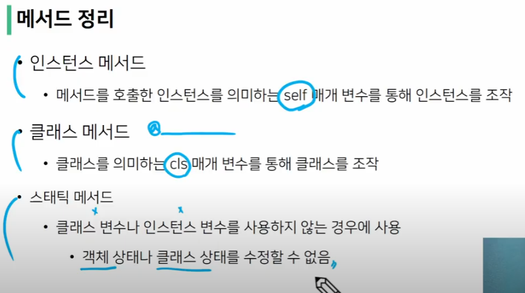
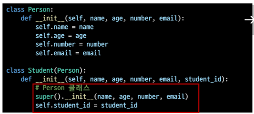
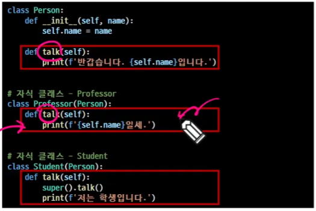
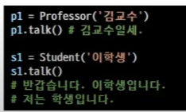
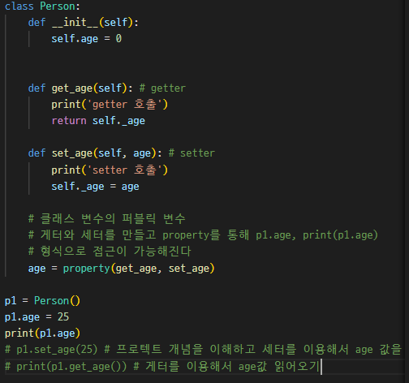
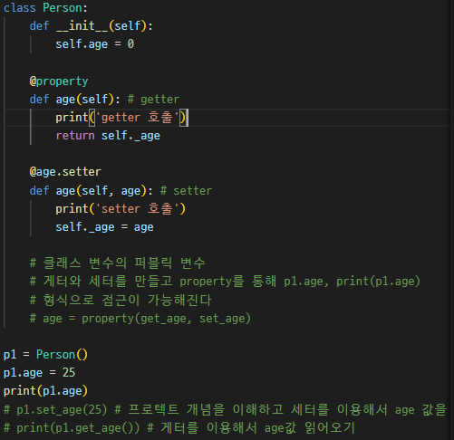

# python_08

- ## 데코레이터
  
  - 함수를 어떤 함수로 꾸며서 새로운 기능을 부여
  
  - 다음 함수의 실행결과를 꾸며줄 뿐이다.
  
  - 데코레이터의 중첩도 가능하다.
  
  - 순서대로 적용 되기 때문에 작성 순서가 중요하다.

## 클래스 메서드와 인스턴스 메서드

- 클래스 메서드는 클래스 메서드 안쪽에서 인스턴스 메서드에 접근할 수 없으므로 클래스 변수를 사용한다.

- 인스턴스 메서드는 인스턴스 변수 사용 인스턴스 메서드 안에서 해당 값이 없으면 클래스 메서드에서 값을 찾기 때문에 클래스 변수, 인스턴스 변수 둘 다 사용이 가능하다.

## 스태틱 메서드

- 스태틱 메서드
  
  - 인스턴스 변수, 클래스 변수를 전혀 다루지 않는 메서드
  
  - 클래스 안쪽에 들어 있는데 클래스 변수도 안쓰고 인스턴스 메서드도 안쓰는데 개념적으로 스태틱 메서드는 이 클래스에서 다루는 함수다, 이 클래스에 연동된 함수다 라는 개념적 느낌을 주기 위해 클래스 안쪽에서 다룬다.
  
  - `@staticmethod` 데코레이터를 사용하여 정의
  
  - `def static_method(args1,.....):`
  
  - 해당 클래스로 한정하는 용도로 사용한다.

## 객체 지향의 핵심 개념

## 객체지향의 핵심 4가지

- 추상화 : 핵심이 되는 부분만 추리기

- 상속 : 코드의 재사용성을 높이면서 기능을 확장한다.

- 다형성 : 각자의 특성에 따라서 다른 결과 만들기

- 캡슐화 : 데이터를 보호하는 것

## 추상화

- 복잡한 것은 숨기고, 필요한 것만 드러내기

## 상속

- 두 클래스 사이 부모 - 자식 관계를 정립하는 것

- 클래스는 상속이 가능하다
  
  - 모든 파이썬 클래스는 object를 상속 받음

- 하위 클래스는 상위 클래스에서 정의된 속성, 행동, 관계 및 제약 조건을 모두 상속 받음

- 부모 클래스의 속성, 메서드가 자식 클래스에 상속되므로, 코드 재사용성이 높아진다.
  
  - 상속 관련 함수와 메서드
  
  - isinstnace(object, classinfo) > 상속받은 클래스가 자식클래스일때 True 반환
  
  - issubclass(class, classinfo)
  
  - super()
    
    - 자식클래스에서 부모클래스를 사용하고 싶은 경우
  
  
  
  상속을 하기위해 studend(person)을 사용하면 person을 상속받는 student 클래스가 된다

- 파이썬의 모든 클래스는 object로 부터 상속됨

- 부모 클래스의 모든 요소(속성, 메서드) 가 상속됨

- super()를 통해 부모 클래스의 요소를 호출할 수 있음

- 상속관계에서의 이름 공간은 인스턴스 자식 클래스, 부모 클래스 순으로 탐색

## 다중 상속

- 두 개 이상의 클래스를 상속 받는 경우

- 중복된 속성이나 메서드가 있는 경우 상속 순서에 의해 결정됨

- 상속받은 모든 클래스의 요소를 활용 가능하다.

### mro메서드

- 해당 인스턴스의 클래스가 어떤 부모 클래스를 가지는지 확인하는 메서드

## 다형성

- 서로 다른 클래스에 속해있는 객체들이 동일한 메시지에 대해 다른 방식으로 응답할 수 있다.

### 메서드 오버라이딩

- 상속받은 메서드를 재정의
  
  - 클래스 상속 시, 부모 클래스에서 정의한 메서드를 자식 클래스에서 변경
  
  - 부모 클래스의 메서드 이름과 기본 기능은 그대로 사용하지만, 특정 기능을 바꾸고 싶을 때 사용한다.

특정한 기능을 수정하기 위해 위에 있는 talk의 print값을 교수 클래스에서 메서드 오버라이딩을 통해 재정의 했음

학생 클래스에서 super.talk()를 통해 talk를 불러와서 쓰고 밑에 프린트로 다시 출력

## 캡슐화(데이터 보호하기)

- 객체의 일부 구현 내용에 대해 외부로부터의 직접적인 접근을 차단

- 파이썬에서 암묵적으로 존재하지만, 언어적으로는 존재하지 않는다.

- 외부의 접근을 제어하는것

### 접근제어자 종류

- public : 모두 가능

- protected : 상속 관계에서만 가능

- private : 나만 가능

#### public member

- 언더바 없이 시작하는 메서드나 속성

- 어디서나 호출이 가능, 하위 클래스 오버라이드 가능

#### protected member

이거 개념적으로만 존재해서 접근해도 접근가능

이거 암묵적으로 활용되서 우리가 보고 인지만 하면 되는거임

- 언더바 1개로 시작하는 메서드나 속성

- 암묵적 규칙에 의해 부모 클래스 내부와 자식 클래스에서만 호출 가능

- 내부적으로 정의된 값을 불러오려면 함수로 다시 정의해서 return 받으면 된다.

- 메서드를 통해서 접근 및 변경하도록 작성해야 된다.

#### private member

- 언더바 2개로 시작하는 메서드나 속성

- 본 클래스 내부에서 사용이 가능

- 이거는 파이썬에서도 막아준다

- 하위클래스나 외부에서 호출 불가능

- 하위 클래스 상속 및 호출 불가능

getter 메서드와 setter 메서드

- 변수에 접근할 수 있는 메서드를 별도로 생성
  
  - getter 변수의 값을 읽는 메서드
    
    - `@property` 데코레이터 사용
  
  - setter 변수의 값을 설정하는 성격의 메서드
    
    - `@변수.setter` 사용

1번 방식

2번 방식

## 에러와 예외

- ### 디버깅
  
  - 잘못된 프로그램을 수정하는 것
  
  - 문법에러
    
    - 에러의 위치를 찾아 메시지를 해결
  
  - 로직에러
    
    - 줄마다 print를 찍어서 어떻게 동작하는지 확인해보기
    
    - 전체 코드를 살펴봄
    
    - 누군가에게 설명해보기

- ### 문법 에러
  
  - syntax 에러

- ### 예외(exception)
  
  - 실행중에 감지되는 에러들을 예외라고 부른다.
  
  - 예외마다 타입이 나타나고 메시지의 일부로 출력된다.
  
  - 예외처리는 작은것부터 처리하고 마지막에 제일 큰 예외처리를 해야한다.
