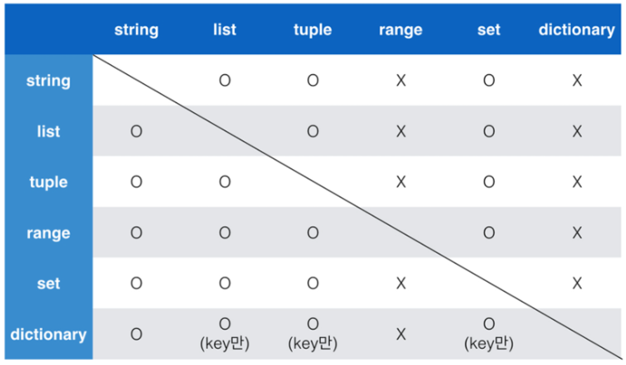

# 파이썬 1차시

> ## 코딩을 배우는 가장 큰 이유
> 
> - 내가 생각하는 것을 컴퓨터를 통해 실현
> 
> ## 프로그래밍이란
> 
> - 적절한 수행 절차를 프로그래밍 언어로 정의
> 
> ## 오류 수정과정
> 
> 1. 구문오류 > 문법 X > 실행 X
> 
> 2. 논리오류 > 문법 O > 실행 O but 결과 X
> 
> ## 프로그래밍 잘하는 법 > CT를 잘하면 된다.
> 
> ## CT를 잘하는법
> 
> 1. 컴퓨터의 특성을 잘 이해한다.
> 
> 2. 문제 해결 능력을 기른다.
>    
>    - 논리적 사고 란 큰 문제를 작은 문제로 쪼개기
> 
> 3. 프로그래밍 언어에 능숙해진다.

## 프로그래밍 언어란

- 기계어의 대안으로 사람이 이해할 수 있는 새로운 언어

- 사람이 이해할 수 있는 문자로 구성되며 기본적인 규칙과 문법이 존재함

## 인터프리터, 컴파일러

- 파이썬은 인터프리터 사용

- 프로그래밍 언어로 작성된 프로그램을 소스 코드라 부르고 그걸 인터프리터를 이용하여 기계어로 번역함

## 코딩환경

- 주피터, vscode

- 파이참
  
  - 알고리즘 개발환경 디버깅 환경이 좀더 잘 되어있음

## 변수(추상화)

- '='을 기준으로 오른쪽에 있는 값을 왼쪽에 할당

- '=' 은 할당 연산자 라고 부르기도 함

- 데이터를 저장하기 위해 사용

- 동일 변수에 다른 데이터를 언제든 할당 할 수 있기 때문에 `'변수' <> 상수` 라고 불림

- **코드의 유지 보수 문제 때문에 변수를 사용해야 함**

> 변수의 할당
> 
> - 같은 값을 동시에 할당 가능
> 
> - 다른 값도 동시에 할당 가능
>   
>   **실습문제 풀기**

```python
x, y = 10, 20
print(x, y) # 20, 10이 나오게 x와 y값을 바꾸기
#1 임시 변수 활용 3번째 공간을 줘서 하나의 값을 내려놓고 다시 들게하는 방법
#2 y, x = x, y
```

## 식별자

- 변수의 이름을 식별자 라고 함

- 프로그래머가 가장 힘들어 하는 일중 하나가 변수명 짓는것임

- 읽기 쉽고 이해하기 쉬운 변수명이 최고임
  
  - 전 세계의 개발자들이 약속한 규칙이 있음
    
    - 변수명은 대부분 `알파벳 _ 숫자` 형태로 구성되며
    
    - 대소문자를 구별함
    
    - 첫글자에 숫자 X
    
    - 파이썬이 가지는 키워드는 변수명으로 사용 X
    
    - 내장함수나 모듈등의 이름도 변수명으로 사용 못함

- ### 주석
  
  - 코드에 대한 쉬운 이해
  
  - 유지보수 용이
  
  - 협업 용이

## 연산자

> - 산술 연산자 
>   
>   - 사칙연산 및 수식 계산
>     
>     - example
>       
>       - `//` > 몫
>       
>       - `**` 거듭제곱

## 자료형과 메모리

### 데이터10을 컴퓨터가 기억하는 과정

1. 주소값에 데이터 10을 넣음

2. 주소값을 불러오면 데이터 10을 가져옴

3. 근데 주소값을 기억하기 어려우니 기억하기 쉬운 이름으로 바꿔서 부름 이걸 `변수`라고 부름

4. 변수의 주소값을 보고 싶으면`id(변수이름)` 쓰면 주소값 나옴

### 자료형 분류

> - 수치형
>   
>   - int(정수 자료형)
>     
>     - 여러 진수 표현 가능(b, o, x)
>   
>   - float(실수 자료형)
>     
>     - 유리수와 무리수를 포함하는 '실수'를 다루는 자료형
>     
>     - 정수는 나누기 2, 소수는 곱하기 2를 해서 표현함
>       
>       - 부동 소수점 사용(의도치 않은 값이 나올수도 있다.)
>       
>       - 매우 작은 수보다 작은지를 확인할때 math 함수 사용
>   
>   - complex
> 
> - 문자열
>   
>   - 모든 문자는 str타입
>   
>   - `''` , `""` 로 표기 가능
>   
>   - 하나의 `.py` 파일 이라면 문자열을 표기할때 하나의 소스코드만 사용 할것을 권장
>   
>   - 중첩 따옴표
>     
>     > 따옴표 안에 따옴표
>     > 
>     > - `''` 안에는 `""` 로 표현
>     > 
>     > - `""` 안에는 `''`로 표현
>     > 
>     > 삼중 따옴표
>     > 
>     > - `'''` ,`"""` 등으로 사용
>     > 
>     > - 여러줄을 나눠 입력할 때 편리함
>   
>   - escape sequence
>     
>     - `\` 뒤에 특정 문자가 와서 특수한 기능을 하는 문자 조합
>     
>     - | 예약 문자 | 내용(의미) |
>       |:-----:|:------:|
>       | \n    | 줄 바꿈   |
>       | \t    | 탭      |
>       | \r    | 캐리지 리턴 |
>       | \o    | 널      |
>       | \ \   | \      |
>       | \'    | 단일인용부호 |
>       | \"    | 이중인용부호 |
>       
>       캐리지 리턴은 문자 출력 순서를 바꿈
>       
>       `'aaa\rbb'` > bbaaa 로 나옴
>     
>     - 문자열 연산도 가능함
>     
>     - f-string
>       
>       - ```python
>         name = 'kim'
>         score = 4.5
>         print(f'hello {kim} 성적은 {score}')
>         ```
> 
> - None
>   
>   - 값이 없음을 표현하기 위해 None 타입이 존재
>   
>   - 일반적으로 반환 값이 없는 함수에서 사용
> 
> - 불린형(Boolean)
>   
>   - 논리 자료형으로 참과 거짓을 표현
>   
>   - True / False 가짐
>   
>   - 비교 / 논리 연산에서 활용
>     
>     - 비교 연산자
>       
>       | 연산자    | 내용              |
>       |:------:|:---------------:|
>       | ==     | 같음              |
>       | !=     | 같지않음            |
>       | is     | 객체 아이덴티티        |
>       | is not | 객체 아이덴티티가 아닌 경우 |
>       
>       함수의 주소값 까지 동일하냐를 비교 할때 is / is not 사용
>     
>     - 논리 연산자
>       
>       - and / or / Not
>       
>       - | 연산자     | 내용                       |
>         |:-------:|:------------------------:|
>         | A and B | A와 B 모두 True시, True      |
>         | A or B  | A와 B 모두 False시, False    |
>         | Not     | True를 False, False를 True |
>         
>         Falsy : False는 아니지만 False 취급
>         
>         `0, 0.0, (), [], {}, None, ""`
>       
>       - 논리 연산자도 우선순위가 존재함
>         
>         - not, and, or 순 인데 괄호써서 쓰면 됨
>     
>     - 논리 연산자의 단축 평가
>       
>       - 결과가 확실한 경우 두번째 값은 확인하지 않고 첫번째 값 반환
>       
>       - and - 첫번째 값이 F >> 무조건 F = 첫번째 값 반환
>       
>       - or - 첫번째 값이 T >> 무조건 T = 첫번째 값 반환


## 컨테이너

> - 여러 개의 값을 담을 수 있는 것 / 서로 다른 자료형을 저장 가능
> 
> ### 컨테이너의 분류
> 
> - 순서가 있는 데이터  == 시퀀스 형
>   
>   - 리스트(가변형)
>     
>     - `list_a = []`
>     
>     - `dust = list()`
>       
>       형식으로 사용
>       
>       두번째 형식은 보통 리스트 형태가 아닌 자료를 리스트로 변환하기 위해 사용함
>   
>   - 튜플(불변형)
>     
>     - 항상 소괄호 형태로 사용
>     
>     - 순서가 있는 구조로 저장하고 싶을 때 사용
>     
>     - 안에 있는 값 변경 불가
>     
>     - 튜플 생성시 `tuple_a = (1,)` 형태로 생성해야 함 구분을 위해
>   
>   - 레인지(불변형)
>     
>     - 순서가 있는 숫자의 시퀀스를 나타내기 위해 사용
> 
> - 슬라이싱 연산자
>   
>   - **주의할점**
>     
>     - 슬라이싱 연산자는 range범위를 벗어나도 오류 없이 가져옴 이 후에 벗어난 범위 새로운 값을 입력했을때 앞전에 사용한 코드에서 오류가 남
>   
>   - 인데스와 콜론을 사용하여 문자열 특정 부분만 잘라낼 수 있음`print([1,2,3,4,5][n:m])`
>   
>   - 0부터 n까지 출력할때 0 생략가능
>     
>     - `[:n]`
>   
>   - n부터 끝까지 출력할때
>     
>     - `[n:]`
> 
> 
> 
> - 순서가 없는 데이터 == 비시퀀스 형
>   
>   - 세트(가변형)
>   
>   - 딕셔너리(가변형)
>     
>     - 키-값 쌍으로 이뤄진 자료형
>     
>     - 슬라이싱 연산자 사용 불가
>     
>     - key는 변경 불가능한 데이터
>       
>       - **str, int, floatm, boolean, tuple, range**
>     
>     - 값은 어떤 형태든 상관 없음

## 형변환

> - 암시적 형변환
>   
>   - 파이썬 내부적으로 자료형을 변환하는 경우
> 
> - 명시적 형변환
>   
>   - 사용자가 특정 함수를 활용하여 의도적으로 자료형을 변환
>   
>   - **str, float => int**
>   
>   - str, int => float
>   
>   - int, float, list, tuple, dict => str(왠만한거 다된다.)


